[TOC]


# 产品方案说明书

  为更好的服务保险用户，提升用户 NPS，现以礼品金 & 积分兑换等服务形式，为用户提供有价值，可用性高的服务，用以提升用户体验，不断提高用户粘性，从而提高用户的复购率。
# 系统功能模块图


# 库存中心

## 交互时序图

### 库存缓存交互时序图

#### ~~方案1(缓存可用兑换码)~~

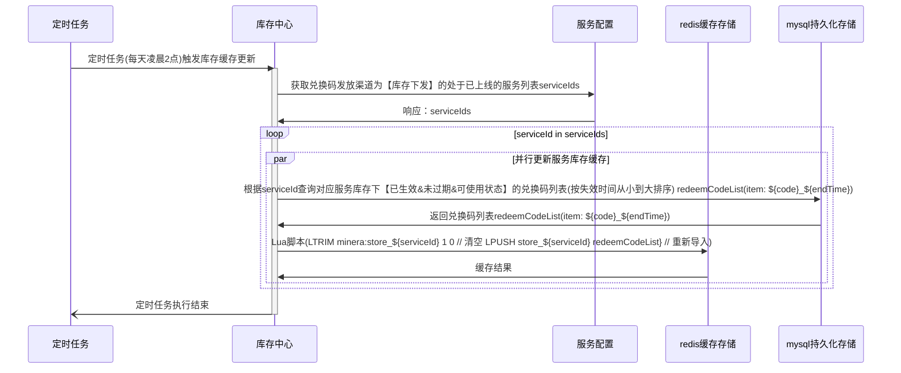

#### 方案2(缓存可用兑换码总数)

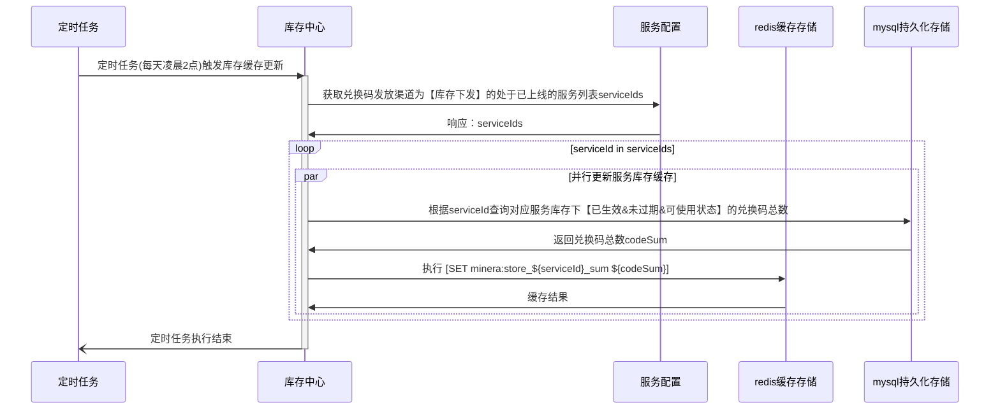

方案3(无需缓存) 创建库存账户表(创建时机：首次创建库存或者创建服务)，直接加锁核销

### 库存核销交互时序图

#### 方案1-(缓存可用兑换码)

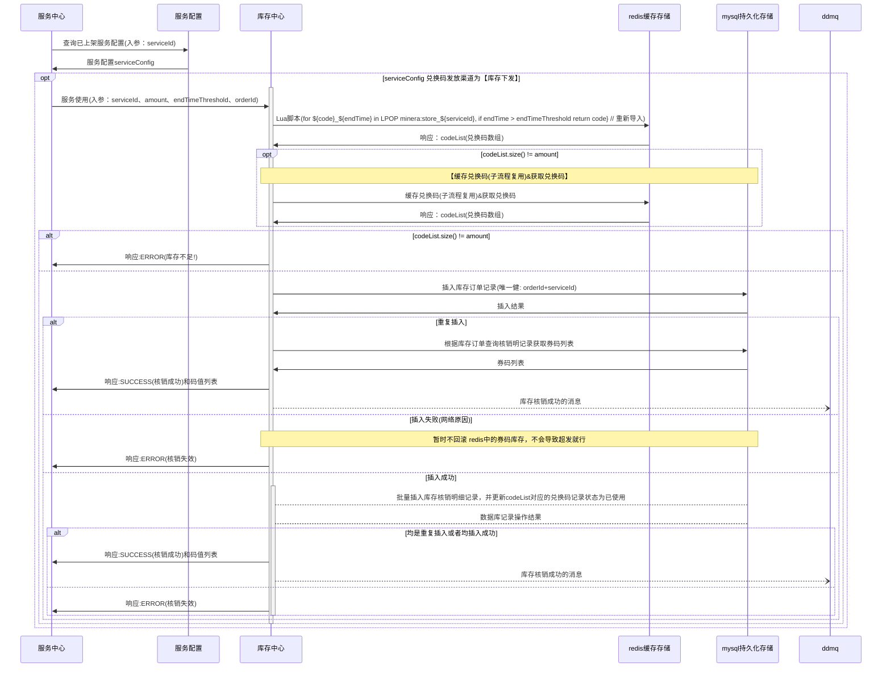

#### 方案2(缓存可用兑换码总数)

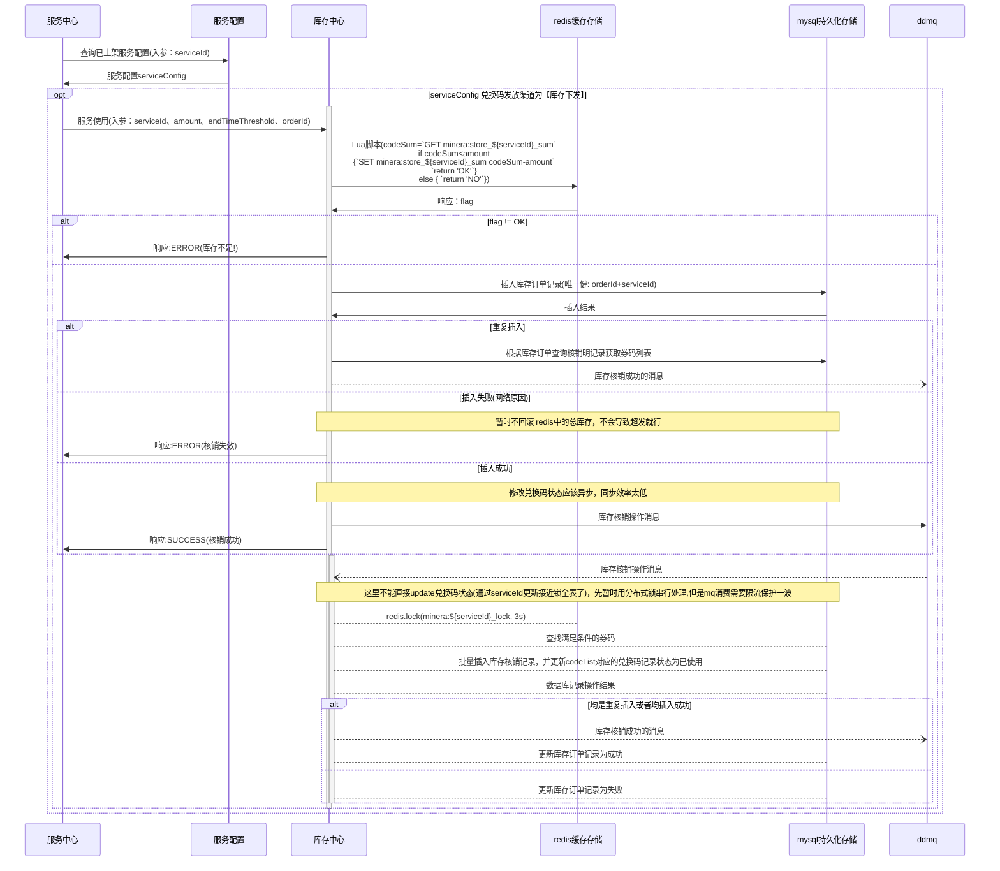

方案3(无需缓存) 创建库存账户表(创建时机：首次创建库存或者创建服务)，直接加锁核销

### ~~方案对比~~

| ~~方案描述~~                   | ~~实现成本~~ | ~~并发性(券码状态更新)~~ | ~~是否会超发~~ |
| ------------------------------ | ------------ | ------------------------ | -------------- |
| ~~方案一(缓存可用兑换码)~~     | ~~较高~~     | ~~较高~~                 | ~~否~~         |
| ~~方案二(缓存可用兑换码总数)~~ | ~~较低~~     | ~~低~~                   | ~~否~~         |

~~考虑到系统稳定性，暂定采用方案二~~

### 库存核增交互时序图

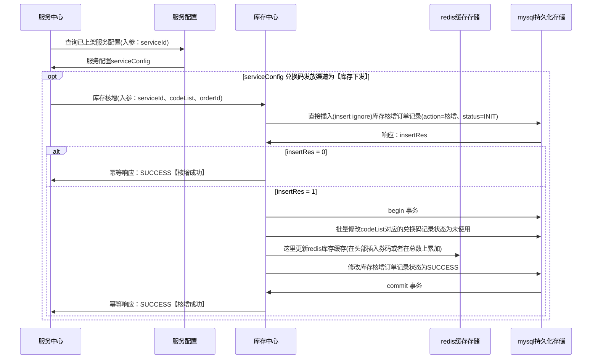


### 库存采购交互时序图

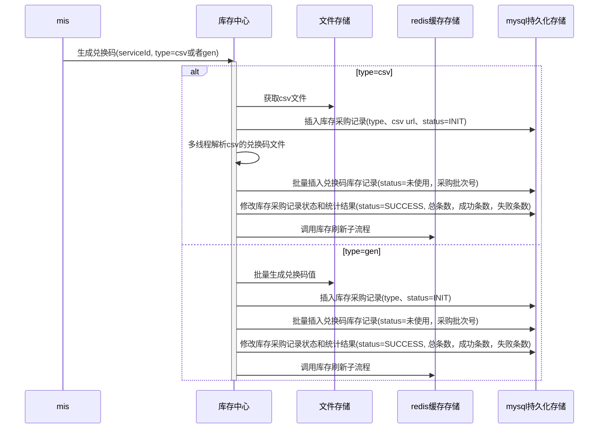

### 库存过期时序图

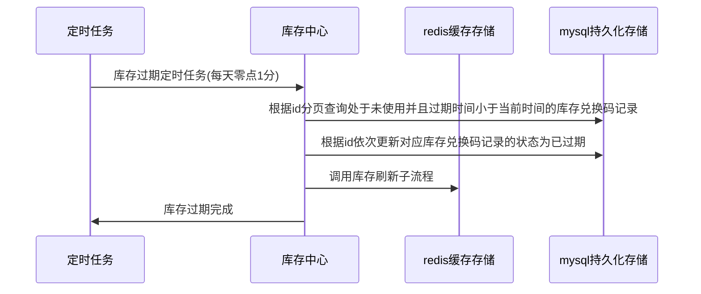


### 库存监控时序图

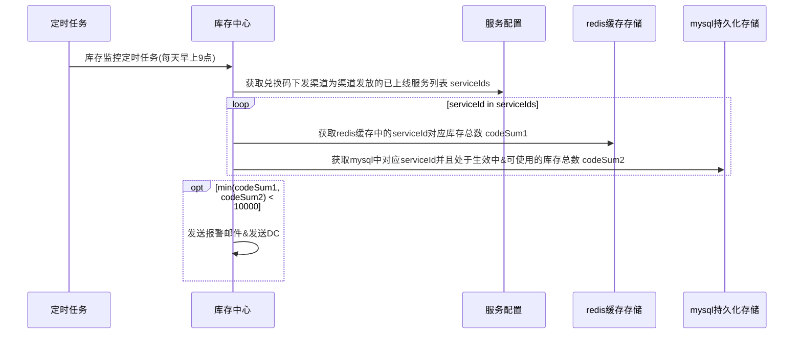

### 库存查询时序图

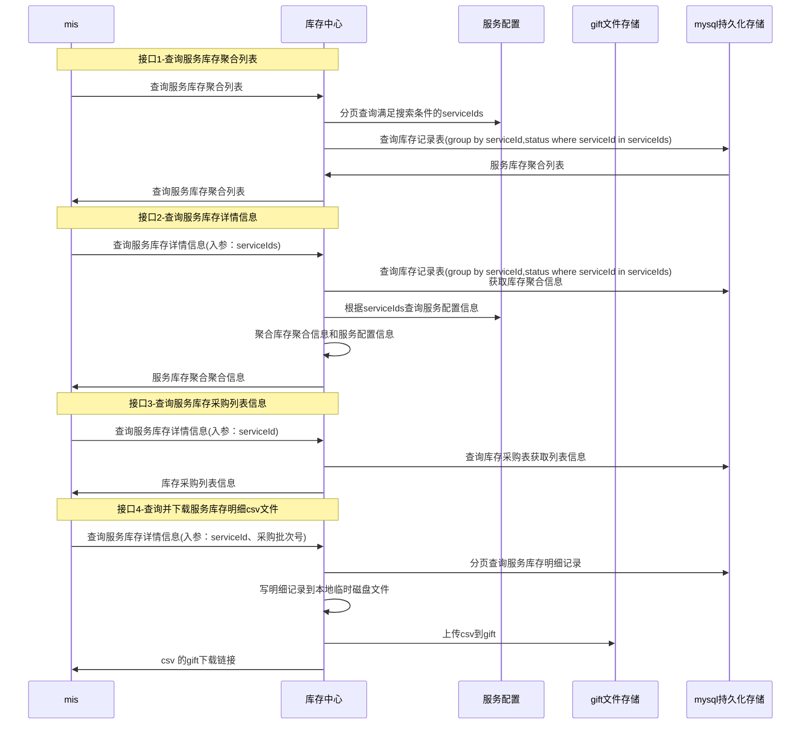

## 数据库模型

#### 商品库存账户表

|   字段名    | 字段类型 |        默认值         |    是否主键     |                             备注                             |    示例    |
| :---------: | :------: | :-------------------: | :-------------: | :----------------------------------------------------------: | :--------: |
|     id      |  bigint  |           0           |       是        |                           自增主键                           |     0      |
|     sku     |  String  |          ''           | 否<br/>唯一索引 | 分类：手机<br/>spu：苹果 6<br/>sku：土豪金 128g 苹果 6 <br/>目前直接取值serviceId |   12345    |
|  sku_name   |  String  |          ''           |       否        |                           sku名称                            | '重疾绿通' |
| useable_cnt |   Int    |           0           |       否        |                         当前可用数量                         |            |
|   status    |   int    |           0           |       否        |                           商品状态                           |   0-正常   |
| create_time | datetime |  '1971-01-01 00:00'   |       否        |                           创建时间                           |            |
| update_time | datetime | '1971-01-01 00:00:00' |       否        |                           修改时间                           |            |

#### 商品库存明细表[store_detail_record]

暂时不分表，后续可以通过 serial_number分表

|      字段名       | 字段类型 |        默认值         |               是否主键               |                             备注                             |    示例    |
| :---------------: | :------: | :-------------------: | :----------------------------------: | :----------------------------------------------------------: | :--------: |
|        id         |  bigint  |           0           |                  是                  |                           自增主键                           |     0      |
| purchase_batch_id |  bigint  |           0           |               普通索引               |                          采购批次id                          |    123     |
|     sku_name      |  Strng   |          ''           |                  否                  |                           sku名称                            | '重疾绿通' |
|        sku        |  String  |          ''           |  sku_serial_number<br/>联合唯一索引  | 分类：手机<br/>spu：苹果 6<br/>sku：土豪金 128g 苹果 6 <br/>目前直接取值serviceId |   12345    |
|   serial_number   |  String  |          ''           |  sku_serial_number<br/>联合唯一索引  |               商品序列号<br />**<u>加密</u>**                |    1234    |
| serial_number_id  |  bigint  |          ''           |          唯一索引(业务主键)          |                         商品序列号id                         |   12345    |
|       extra       |   text   |                       |                  否                  |                         其它额外信息                         |            |
|      status       |   int    |           0           |                  否                  |         状态<br/>0-未下发<br/>1-已下发<br/>2-已过期          |            |
|  effective_time   | datetime | '1971-01-01 00:00:00' | invalid_time_effective_time 普通索引 |                           生效时间                           |            |
|   invalid_time    | datetime | '1971-01-01 00:00:00' | invalid_time_effective_time 普通索引 |                           失效时间                           |            |
|    create_time    | datetime | '1971-01-01 00:00:00' |                  否                  |                           创建时间                           |            |
|    update_time    | datetime | '1971-01-01 00:00:00' |                  否                  |                           修改时间                           |            |

#### 商品库存采购批次表[store_purchase_record]

|      字段名       | 字段类型 |        默认值         | 是否主键 |                             备注                             |                 示例                 |
| :---------------: | :------: | :-------------------: | :------: | :----------------------------------------------------------: | :----------------------------------: |
|        id         |  bigint  |           0           |    是    |                           自增主键                           |                  0                   |
| purchase_batch_id |  bigint  |           0           | 业务主键 |                          采购批次id                          |                 123                  |
|   purchase_type   |   int    |           0           |    否    |            采购方式<br />0-csv导入<br />1-自生成             |                  1                   |
|     sku_name      |  Strng   |          ''           |    否    |                   sku名称<br />serviceName                   |              '重疾绿通'              |
|        sku        |  String  |          ''           |    否    | 分类：手机<br/>spu：苹果 6<br/>sku：土豪金 128g 苹果 6 <br/>serviceId |                12345                 |
|      status       |   int    |           0           |    否    |           状态<br/>0-初始化-<br/>1-成功<br/>2-失败           |                  0                   |
|      all_cnt      |   int    |           0           |    否    |                          应导总条数                          |                12345                 |
|    success_cnt    |   int    |           0           |    否    |                        实际导入成功数                        |                 123                  |
|       extra       |   text   |                       |    否    |                         其它额外信息                         | {"csvUrl":"https://123456789/a.csv"} |
|     operator      |  string  |          ''           |    否    |                            操作人                            |                                      |
|    create_time    | datetime | '1971-01-01 00:00:00' |    否    |                           创建时间                           |                                      |
|    update_time    | datetime | '1971-01-01 00:00:00' |    否    |                           修改时间                           |                                      |

### 商品库存操作流水表[store_flow_record]

暂时不分表，后续可以通过 serial_number分表

|      字段名       | 字段类型 |        默认值         |                         是否主键                         |                             备注                             |    示例    |
| :---------------: | :------: | :-------------------: | :------------------------------------------------------: | :----------------------------------------------------------: | :--------: |
|        id         |  bigint  |           0           |                            是                            |                           自增主键                           |     0      |
|  order_record_id  |  bigint  |           0           |                       业务唯一主键                       |                         业务唯一主键                         |     0      |
| source_identifier |   int    |           0           | source_trade_no_source_identifier_sku <br />联合唯一索引 |                          业务方标识                          |    123     |
|  source_trade_no  |  strng   |          ''           | source_trade_no_source_identifier_sku <br />联合唯一索引 |                     业务方编号，用于幂等                     | '重疾绿通' |
|     sku_name      |  Strng   |          ''           |                            否                            |                   sku名称<br />serviceName                   | '重疾绿通' |
|        sku        |  string  |          ''           | source_trade_no_source_identifier_sku <br />联合唯一索引 | 分类：手机<br/>spu：苹果 6<br/>sku：土豪金 128g 苹果 6 <br/>目前直接取值serviceId |   12345    |
|    action_type    |   int    |           0           |                            否                            |              操作类型：<br />0-核销<br />1-核增              |     0      |
|      amount       |   int    |           0           |                            否                            |                             数量                             |    1234    |
|       extra       |   text   |                       |                            否                            |                         其它额外信息                         |            |
|      status       |   int    |           0           |                            否                            |           状态<br/>0-初始化<br/>1-成功<br/>2-失败            |            |
|    create_time    | datetime | '1971-01-01 00:00:00' |                            否                            |                           创建时间                           |            |
|    update_time    | datetime | '1971-01-01 00:00:00' |                            否                            |                           修改时间                           |            |

### 商品库存操作流水明细表[store_flow_detail_record]

暂时不分表，后续可以通过 serial_number分表

|         字段名         | 字段类型 |        默认值         |                         是否主键                         |                             备注                             |    示例    |
| :--------------------: | :------: | :-------------------: | :------------------------------------------------------: | :----------------------------------------------------------: | :--------: |
|           id           |  bigint  |           0           |                            是                            |                           自增主键                           |     0      |
|    order_record_id     |  bigint  |           0           |                         普通索引                         |                      库存操作流水记录id                      |     0      |
| order_record_detail_id |  bigint  |           0           |                       业务唯一主键                       |                    库存操作流水明细记录id                    |            |
|   source_identifier    |   int    |           0           | source_trade_no_source_identifier_sku <br />联合普通索引 |                          业务方标识                          |    123     |
|    source_trade_no     |  strng   |          ''           | source_trade_no_source_identifier_sku <br />联合普通索引 |                     业务方编号，用于幂等                     | '重疾绿通' |
|        sku_name        |  Strng   |          ''           |                            否                            |                   sku名称<br />serviceName                   | '重疾绿通' |
|          sku           |  string  |          ''           | source_trade_no_source_identifier_sku <br />联合普通索引 | 分类：手机<br/>spu：苹果 6<br/>sku：土豪金 128g 苹果 6 <br/>目前直接取值serviceId |   12345    |
|      action_type       |   int    |           0           |                            否                            |              操作类型：<br />0-核销<br />1-核增              |     0      |
|    serial_number_id    |  bigint  |           0           |                         普通索引                         |                         商品序列号id                         |    1234    |
|         extra          |   text   |                       |                            否                            |                         其它额外信息                         |            |
|         status         |   int    |           0           |                            否                            |           状态<br/>0-初始化<br/>1-成功<br/>2-失败            |            |
|      create_time       | datetime | '1971-01-01 00:00:00' |                            否                            |                           创建时间                           |            |
|      update_time       | datetime | '1971-01-01 00:00:00' |                            否                            |                           修改时间                           |            |

#### 实体关系图

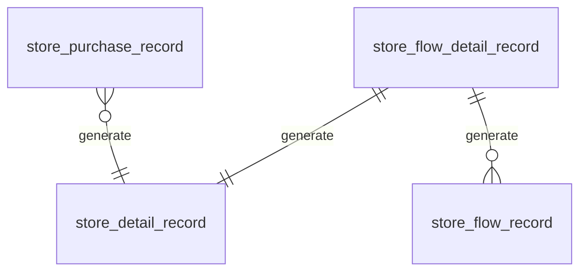

#### 兑换码状态流转图

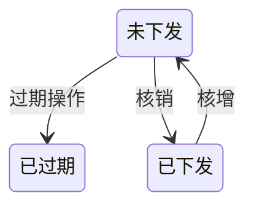


## 外部能力

#### 接口能力

##### 库存核销

- 入参：sku(serviceId)、source_identifier(库存中心分配)、source_trade_no(业务单号)、amount(核销数量)
- 出参：核销结果(成功/失败)，核销的兑换码通过消息异步返回

##### 库存核增

- 入参：sku(serviceId)、source_identifier(库存中心分配)、source_trade_no(业务单号)、serial_number_ids(核增的商品库存序列码id)
- 出参：核增结果(成功/失败)

##### 库存查询

- 入参：skuList
- 出参：各个商品可用库存数量数组

##### 库存聚合信息列表查询

- 入参：服务配置查询相关参数(服务名称、服务id、服务code、供应商)、分页参数
- 出参：各个商品库存总数、过期总数、已下发总数、未下发总数聚合信息数组

##### 库存采购操作列表记录查询

- 入参：服务id
- 出参：对应服务商品的库存采购操作记录列表

##### 库存兑换码明细导出

- 入参：serviceId(服务id) || purchase_batch_id(采购批次id)
- 出参：对应库存记录列表的csv文件的gift 下载地址

##### 采购库存(生成兑换码)

- 入参：采购类型(csv 导入||自生成)、csv文件git路径(或者生成数量)、库存生效&&失效时间
- 出参：csv 导入(导入结果明细)、自生成(成功||失败)

#### 消息能力

##### 核销成功消息

- 触发时机：兑换码库存核销成功(一个兑换码一条消息)
- 消息字段：sku(serviceId)、source_identifier(库存中心分配)、source_trade_no(业务单号)、serial_number_id、serial_number

## 外部依赖

### 接口依赖

#### 服务配置中心

##### 分页查询服务配置

- 入参：服务id、供应商、兑换码下发渠道等，分页参数
- 出参:  服务配置数组

## 工期(10.5PD)

### 前期准备 2PD

#### 接口文档(1.5PD)

- 库存核销
- 库存核增
- 库存查询
- 库存聚合信息列表查询
- 库存采购操作列表记录查询
- 库存兑换码明细导出
- 采购库存(生成兑换码)

#### 项目搭建(0.5PD)

### 开发(8.5PD)

- 库存缓存定时任务  1.5PD
- 库存过期定时任务  1PD

- 库存核销  1.5PD
- 库存核增  1PD
- 库存查询  0.25PD
- 库存聚合信息列表查询 0.25PD
- 库存采购操作列表记录查询 0.5PD
- 库存兑换码明细导出 1PD
- 采购库存(生成兑换码) 1.5PD


# 服务中心

## 系统交互时序图

### 服务发放/兑换交互时序图

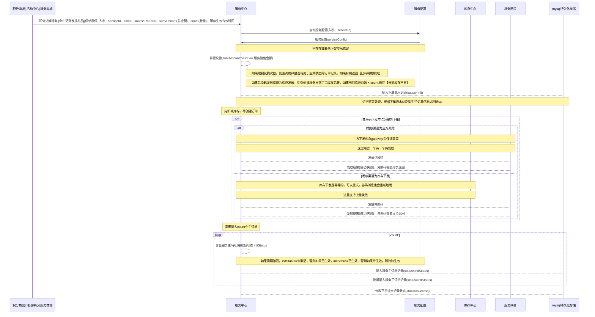

#### 服务激活交互时序图


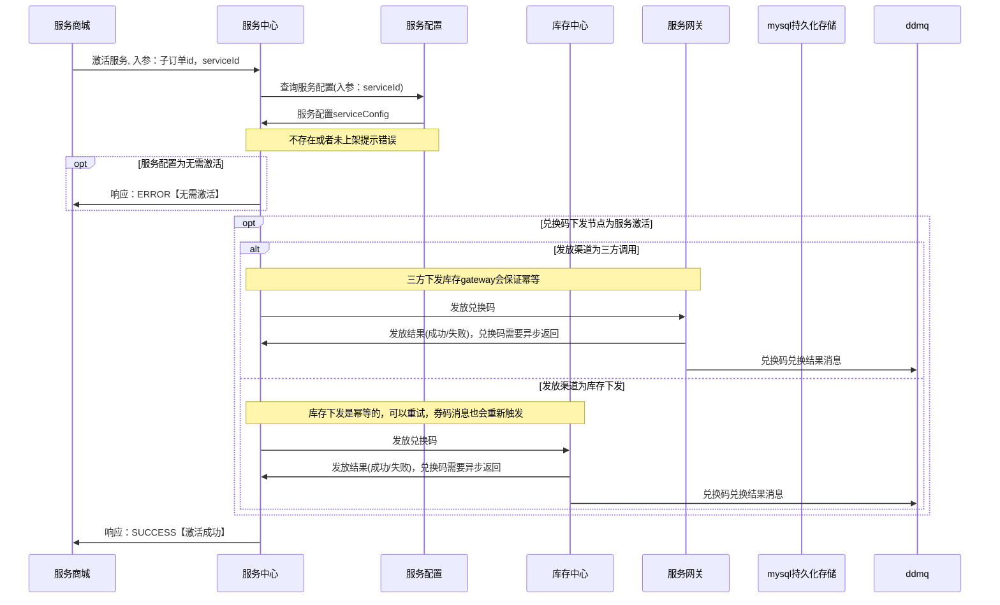

### 服务使用交互时序图

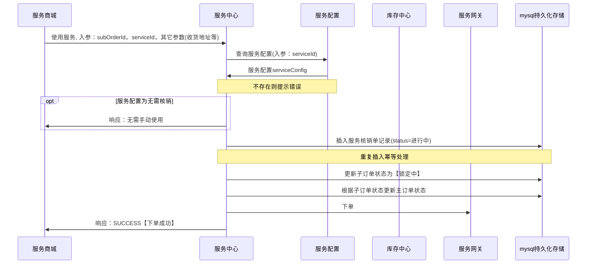

### 服务回退交互时序图

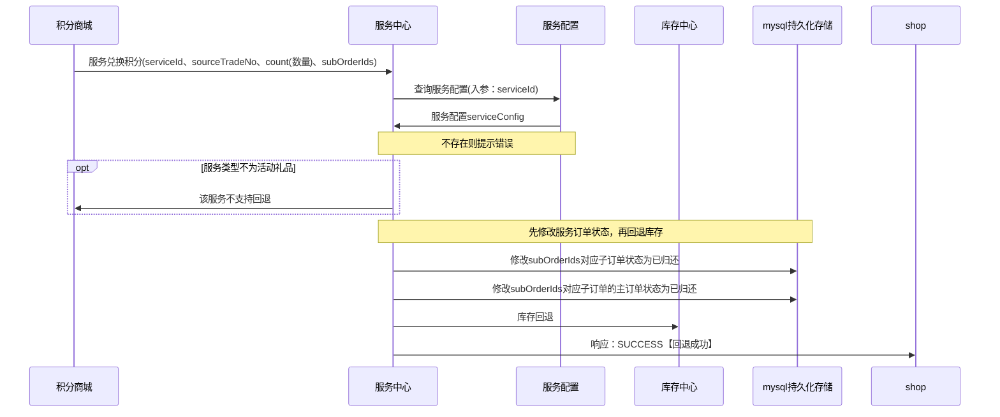

### 

### 服务兑换码回调交互时序图

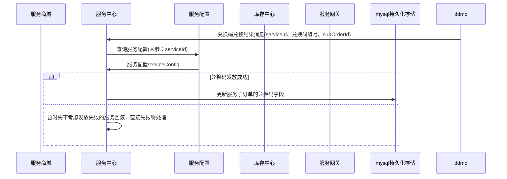


### 服务核销回调交互时序图

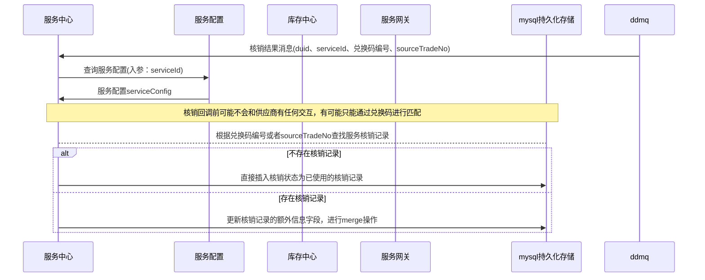


### 服务过期交互时序图

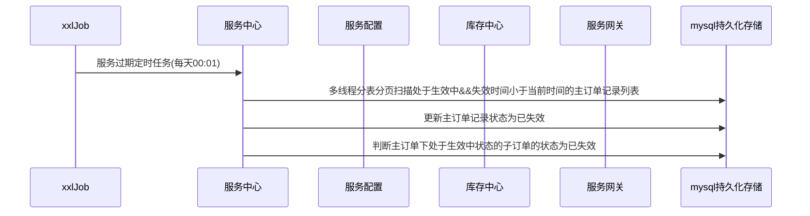


### 服务单查询交互时序图

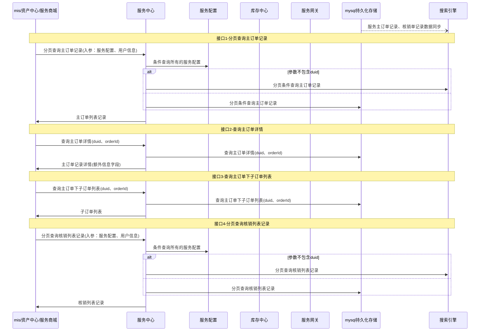

### ~~服务单线下核销交互时序图~~


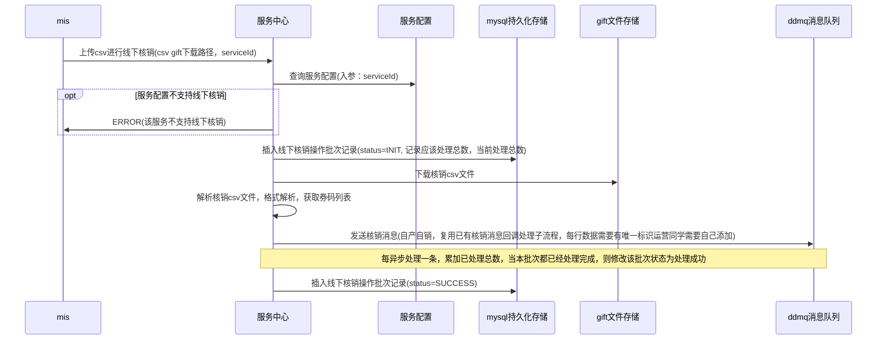

### 供应商跳转链接参数获取

```mermaid
sequenceDiagram
    participant service as 服务中心
    participant gateway as 服务网关

service->>gateway: 获取H5跳转链接的外部额外参数map, 入参：链接类型&兑换码&子订单号
gateway->>service: 额外跳转链接的额外参数map

```


### ~~服务单线下核销批次记录查询~~

单表查询，省略

### 账户注销

已有功能，按规范接入即可，带duid的表均需要进行归档处理

## 数据模型

### 数据库表模型

#### 服务订单操作流水记录表(service_order_flow_record_{0,1023})

按duid 分表 

|      字段名       | 字段类型 |        默认值         |                           是否主键                           |                             备注                             |    示例    |
| :---------------: | :------: | :-------------------: | :----------------------------------------------------------: | :----------------------------------------------------------: | :--------: |
|        id         |  bigint  |           0           |                              是                              |                           自增主键                           |     0      |
|  flow_record_id   |  bigint  |           0           |                         唯一业务主键                         |                         业务唯一主键                         |            |
|       duid        |  bigint  |           0           | duid_source_trade_no_source_identifier_sku <br />联合唯一索引 |                             duid                             |     0      |
| source_identifier |   int    |           0           | duid_source_trade_no_source_identifier_sku <br />联合唯一索引 |                          业务方标识                          |    123     |
|  source_trade_no  |  strng   |          ''           | duid_source_trade_no_source_identifier_sku <br />联合唯一索引 |                     业务方编号，用于幂等                     | '重疾绿通' |
|     sku_name      |  Strng   |          ''           |                              否                              |                   sku名称<br />serviceName                   | '重疾绿通' |
|        sku        |  string  |          ''           | duid_source_trade_no_source_identifier_sku <br />联合唯一索引 | 分类：手机<br/>spu：苹果 6<br/>sku：土豪金 128g 苹果 6 <br/>目前直接取值serviceId |   12345    |
|       count       |   int    |           0           |                              否                              |                    本次下单/退还服务次数                     |            |
|    action_type    |   int    |           0           |                              否                              |              操作类型：<br />0-下单<br />1-退还              |     0      |
|       extra       |   text   |                       |                              否                              |                         其它额外信息                         |            |
|      status       |   int    |           0           |                              否                              |           状态<br/>0-初始化<br/>1-成功<br/>2-失败            |            |
|    create_time    | datetime | '1971-01-01 00:00:00' |                              否                              |                           创建时间                           |            |
|    update_time    | datetime | '1971-01-01 00:00:00' |                              否                              |                           修改时间                           |            |

#### 服务主订单记录表(service_order_{0,1023})

按duid 分表 

|         字段名         | 字段类型 |        默认值         |                         是否主键                          |                             备注                             |    示例    |
| :--------------------: | :------: | :-------------------: | :-------------------------------------------------------: | :----------------------------------------------------------: | :--------: |
|           id           |  bigint  |           0           |                            是                             |                           自增主键                           |     0      |
|        order_id        |  bigint  |           0           |                       唯一业务主键                        |                         业务唯一主键                         |            |
|          duid          |  bigint  |           0           | duid_source_trade_no_source_identifier_sku <br />普通索引 |                             duid                             |     0      |
|          uid           |  bigint  |           0           |                            否                             |                             uid                              |            |
|          role          |   int    |           0           |                            否                             |                             role                             |            |
|   source_identifier    |   int    |           0           | duid_source_trade_no_source_identifier_sku <br />普通索引 |                          业务方标识                          |    123     |
|    source_trade_no     |  strng   |          ''           | duid_source_trade_no_source_identifier_sku <br />普通索引 |                     业务方编号，用于幂等                     | '重疾绿通' |
|        sku_name        |  Strng   |          ''           |                            否                             |                   sku名称<br />serviceName                   | '重疾绿通' |
|          sku           |  string  |          ''           | duid_source_trade_no_source_identifier_sku <br />普通索引 | 分类：手机<br/>spu：苹果 6<br/>sku：土豪金 128g 苹果 6 <br/>目前直接取值serviceId |   12345    |
|       all_count        |   Int    |           0           |                            否                             |              可兑换使用总次数<br />-1：不限次数              |            |
|         extra          |   text   |                       |                            否                             |                         其它额外信息                         |            |
|         status         |   int    |           0           |                            否                             |    1-已回收<br /> 2-待使用 <br />3-已使用 4<br />-已失效     |            |
| service_effective_time | datetime | '1971-01-01 00:00:00' |                            否                             |                         服务生效时间                         |            |
|  service_invalid_time  | datetime | '1971-01-01 00:00:00' |                            否                             |                         服务失效时间                         |            |
| useable_effective_time | datetime | '1971-01-01 00:00:00' |                            否                             |                        可兑换生效时间                        |            |
| useable_effective_time | datetime | '1971-01-01 00:00:00' |                            否                             |                        可兑换失效时间                        |            |
|      create_time       | datetime | '1971-01-01 00:00:00' |                            否                             |                           创建时间                           |            |
|      update_time       | datetime | '1971-01-01 00:00:00' |                            否                             |                           修改时间                           |            |

#### 服务子订单记录表(service_sub_order_{0,1023})

按duid 分表 

|      字段名       | 字段类型 |        默认值         |                           是否主键                           |                             备注                             |    示例    |
| :---------------: | :------: | :-------------------: | :----------------------------------------------------------: | :----------------------------------------------------------: | :--------: |
|        id         |  bigint  |           0           |                              是                              |                           自增主键                           |     0      |
|   sub_order_id    |  bigint  |                       |                         唯一业务主键                         |                         唯一业务主键                         |            |
|     order_id      |  bigint  |           0           |                           普通索引                           |                         业务唯一主键                         |            |
|       duid        |  bigint  |           0           | duid_source_trade_no_source_identifier_sku <br />联合普通索引 |                             duid                             |     0      |
|        uid        |  bigint  |           0           |                              否                              |                             uid                              |            |
|       role        |   int    |           0           |                              否                              |                             role                             |            |
| source_identifier |   int    |           0           | duid_source_trade_no_source_identifier_sku <br />联合普通索引 |                          业务方标识                          |    123     |
|  source_trade_no  |  strng   |          ''           | duid_source_trade_no_source_identifier_sku <br />联合普通索引 |                          业务方编号                          | '重疾绿通' |
|     sku_name      |  Strng   |          ''           |                              否                              |                   sku名称<br />serviceName                   | '重疾绿通' |
|        sku        |  string  |          ''           | duid_source_trade_no_source_identifier_sku <br />联合唯一索引 | 分类：手机<br/>spu：苹果 6<br/>sku：土豪金 128g 苹果 6 <br/>目前直接取值serviceId |   12345    |
|   serial_number   |  String  |          ''           |                  serial_number<br/>普通索引                  |               商品序列号<br />**<u>加密</u>**                |    1234    |
|       extra       |   text   |                       |                              否                              |                         其它额外信息                         |            |
|      status       |   int    |           0           |                              否                              | 1、已回收<br />2、未激活（服务配置为需要激活，用户未激活时） <br />3、待生效 <br />4、已生效 <br />5、已使用 <br />6、锁定中（核销下单后，有一段时间才能返回核销结果，此时服务锁定中，禁止再下单） <br />7、已失效（服务兑换有效期结束且用户未兑换服务 or 服务有效期结束 or 保单状态变更时） |            |
|    create_time    | datetime | '1971-01-01 00:00:00' |                              否                              |                           创建时间                           |            |
|    update_time    | datetime | '1971-01-01 00:00:00' |                              否                              |                           修改时间                           |            |

#### 服务使用记录表(service_use_record_{0,1023})

按duid 分表 

|      字段名       | 字段类型 |        默认值         |                           是否主键                           |                             备注                             |    示例    |
| :---------------: | :------: | :-------------------: | :----------------------------------------------------------: | :----------------------------------------------------------: | :--------: |
|        id         |  bigint  |           0           |                              是                              |                           自增主键                           |     0      |
|   use_record_id   |  bigint  |           0           |                         唯一业务主键                         |                         业务唯一主键                         |            |
|       duid        |  bigint  |           0           |  duid_source_trade_no_source_identifier_sku <br />普通索引   |                             duid                             |     0      |
|        uid        |  bigint  |           0           |                              否                              |                             uid                              |            |
|       role        |   int    |           0           |                              否                              |                             role                             |            |
| source_identifier |   int    |           0           |  duid_source_trade_no_source_identifier_sku <br />普通索引   |                          业务方标识                          |    123     |
|  source_trade_no  |  strng   |          ''           |  duid_source_trade_no_source_identifier_sku <br />普通索引   |                     业务方编号，用于幂等                     | '重疾绿通' |
|        sku        |  string  |          ''           | duid_source_trade_no_source_identifier_sku <br />联合唯一索引 | 分类：手机<br/>spu：苹果 6<br/>sku：土豪金 128g 苹果 6 <br/>目前直接取值serviceId |   12345    |
|   serial_number   |  String  |          ''           |                  serial_number<br/>普通索引                  |               商品序列号<br />**<u>加密</u>**                |    1234    |
|       extra       |   text   |                       |                              否                              |                         其它额外信息                         |            |
|      status       |   int    |           0           |                              否                              | 进行中（比如拖车服务，下了核销单后，需要一段时间才能完成服务） <br />已完成 <br />已取消（当服务单下单后，用户没有用，取消了） |            |
|    create_time    | datetime | '1971-01-01 00:00:00' |                              否                              |                           创建时间                           |            |
|    update_time    | datetime | '1971-01-01 00:00:00' |                              否                              |                           修改时间                           |            |

#### ~~服务线下核销批次记录表~~

### 状态流转图


#### 主订单状态流转

| 子订单状态 | 判断条件                | 主订单状态 |
| :--------- | :---------------------- | :--------- |
| 已回收     | ALL 子订单 = 已回收状态 | 已回收     |
| 未激活     | 子订单未激活个数≥1      | 待使用     |
| 待生效     | 子订单待生效个数≥1      | 待使用     |
| 已生效     | 子订单已生效个数≥1      | 待使用     |
| 已使用     | 子订单已使用个数≥1      | 已使用     |
| 锁定中     | 子订单锁定中个数≥1      | 已使用     |
| 已失效     | ALL 子订单 = 已失效状态 | 已失效     |

#### 子订单状态流转图

```mermaid
stateDiagram-v2
    * --> 未激活: 服务下单&&需要激活
    * --> 待生效: 服务下单&&不需要激活&&还未生效
    * --> 生效中: 服务下单&&不需要激活&&已生效
    生效中 --> 已使用: 收到兑换码消息&&无需核销&&非保单类服务
    未激活 --> 已使用: 收到激活成功消息&&无需核销
    未激活 --> 待生效: 收到激活成功消息&&还未生效
    未激活 --> 生效中: 收到激活成功消息&&当前服务生效中
    未激活 --> 已失效: 收到激活成功消息&&当前服务已失效
    待生效 --> 生效中: 当前服务已生效
    生效中 --> 锁定中: 非不限次数使用&&服务使用中
    锁定中 --> 已使用: 非不限次数使用&&核销完成
    生效中 --> 已失效: 当前服务已失效
    生效中 --> 已回收: 退货
```

#### 核销单状态流转图

```mermaid
stateDiagram-v2
    * --> 进行中: 服务使用
    * --> 已完成: 服务直接核销
    * --> 已取消: 暂不考虑
    进行中 --> 已完成: 服务核销
    进行中 --> 已取消: 暂不考虑
    
```


## 外部能力

### service能力

- 批量兑换/发放服务

  入参：serviceId、唯一业务单号、sumAmount(服务总金额)、sumCount(服务总数量)

  响应：兑换结果

- 激活服务

  入参：serviceId、subOrderId

  响应：激活结果

- 批量退还服务

  入参：serviceId、subOrderIdList

  响应：退还结果

- 获取三方供应商H5额外链接参数

  入参：serviceId、兑换码、subOrderId

  响应：链接参数Map

### 接口能力

- 4 个基本查询接口

  入参：serviceId、兑换码、subOrderId

  响应：链接参数Map

### 消息能力

 无，暂无需求

## 外部依赖

### 接口依赖

####  服务配置中心

- 条件查询所有服务配置

  入参：服务配置字段

  响应：服务配置列表

####  库存中心

- 库存核销
- 库存核增
- 服务可用库存查询

####  服务网关

- 兑换码获取
- 服务使用
- H5链接额外参数获取

### 消息依赖

####  库存中心

- 兑换码发放结果消息

####  服务网关

- 兑换码发放结果消息
- 核销回调消息

## 排期(9.5PD)

### 前期准备 0.5PD

#### 接口文档(10.5PD)

- 4 个基本查询接口 0.5PD
- 库存核增
- 库存查询
- 库存聚合信息列表查询
- 库存采购操作列表记录查询
- 库存兑换码明细导出
- 采购库存(生成兑换码)

#### 项目搭建(0PD)

### 开发(10PD)

- 批量兑换/发放服务  1.5PD
- 激活服务 0.5PD
- 批量退还服务 1.5PD
- 获取三方供应商H5额外链接参数  0.5PD
- 兑换码发放回调消息处理  1PD
- 核销回调消息处理  1.5PD
- 订单过期 1PD
- 4个基本查询接口 1.5PD
- 账户注销处理(1PD)

# 服务商城

##  数据模型

### 服务类页面配置模型

#### 字典配置

##### 文本字体大小

| 标识(key) | 描述     | value | 效果示例图片 |
| --------- | -------- | ----- | ------------ |
| Key1      | 通用字体 | 5号   | http://1.img |
| Key2      | 5号字体  | 5     | http://1.img |
| Key3      | 6号字体  | 6     | http://1.img |

##### 文本颜色

| 标识(key) | 描述     | value | 效果示例图片 |
| --------- | -------- | ----- | ------------ |
| Key1      | 通用颜色 | black | http://1.img |
| Key2      | 5号字体  | red   | http://1.img |
| Key3      | 6号字体  | blue  | http://1.img |

##### 字段取值配置

| 标识(key) | 描述                    | value               | 来源标识 |
| --------- | ----------------------- | ------------------- | -------- |
| Key1      | 主订单号                | ${data.orderId}     | Func1    |
| Key2      | 保险公司名称            | ${data.companyName} | Func1    |
| Key3      | 生效日期-yyyyMMdd HH:ss | ${data.startTime}   | Func2    |

#### 控件配置

##### 动态文本[DynTitle]

+Font{360.font, }+积分

| 字段名     | 字段类型 | 是否必填 | 备注                                           | 示例值           |
| ---------- | -------- | -------- | ---------------------------------------------- | ---------------- |
| id         | int      | 是       | 控件类型                                       | 1                |
| titleType  | int      | 否       | 文本类型<br />1-普通文本，默认<br />2-动态取值 | 2                |
| titleValue | String   | 是       | 普通文本，或者字段取值标识                     | ”你好“<br />Key1 |
| fontSize   | String   | 否       | 字体大小                                       | Key1             |
| fontColor  | String   | 否       | 字体颜色                                       | Key1             |

##### 动态链接[DynLink]

| 字段名    | 字段类型            | 是否必填 | 备注                                           | 示例值           |
| --------- | ------------------- | -------- | ---------------------------------------------- | ---------------- |
| id        | int                 | 是       | 控件类型                                       | 1                |
| title     | String              | 是       | 链接文本                                       |                  |
| type      | int                 | 否       | 文本类型<br />1-普通链接，默认<br />2-动态取值 | 2                |
| preFixUrl | String              | 是       | 固定前缀域名                                   | ”你好“<br />Key1 |
| params    | map<String，string> | 否       | 动态参数取值，来源于字段取值配置表             |                  |

服务按钮(ServiceButtun)

| 字段名             | 字段类型              | 是否必填 | 备注                                                         | 示例值           |
| ------------------ | --------------------- | -------- | ------------------------------------------------------------ | ---------------- |
| id                 | int                   | 是       | 控件类型                                                     | 2                |
| actionType         | int                   | 是       | 按钮类型<br />1-跳转链接<br />2-动态获取链接并跳转<br />3-置换积分-接口调用<br />4-复制券码并跳转链接<br />5-复制券码并动态跳转链接<br />6-电话预约<br />7-兑换服务-接口调用<br />8-发放券码-接口调用<br />9-激活服务-接口调用 | 2                |
| actionValue        | String/List<DynTitle> | 否       | url(链接类)或者接口标识(接口类)或者弹窗文本(电话预约类)      |                  |
| buttunTitle        | List<DynTitle>        | 是       | 按钮文案<br />动态文本                                       | ”你好“<br />Key1 |
| titleTopOverButtun | List<DynTitle>        | 是       | 按钮上方文案<br />动态文本                                   | ”你好“<br />Key1 |
| 图标字段           |                       |          |                                                              |                  |
| buttunImg          | String                | 是       | 按钮图片                                                     |                  |
| toastBeforeAction  | List<DynTitle>        | 否       | 按钮动作触发前Toast提示文本<br />动态文本                    | ”你好“<br />Key1 |
| toastAfterAction   | List<DynTitle>        | 否       | 按钮动作触发后Toast提示文本<br />动态文本                    | ”你好“<br />Key1 |

#### 服务类组件

#####  图片组件(Image)

| 字段名 | 字段类型 | 是否必填 | 备注     | 示例值 |
| ------ | -------- | -------- | -------- | ------ |
| id     | int      | 是       | 组件类型 | 45     |
| imgUrl | String   | 是       | 图片url  |        |
| order  | int      | 是       | 顺序     |        |

##### 标题组件(newTitle)

| 字段名 | 字段类型       | 是否必填 | 备注                            | 示例值 |
| ------ | -------------- | -------- | ------------------------------- | ------ |
| id     | int            | 是       | 组件类型                        | 46     |
| order  | int            | 是       | 顺序                            | 顺序   |
| title  | List<DynTitle> | 是       | titleType为动态文本时，需要解析 |        |

##### 通用悬底按钮区(CommonButtonArea)

| 字段名          | 字段类型            | 是否必填 | 备注             | 示例值 |
| --------------- | ------------------- | -------- | ---------------- | ------ |
| id              | int                 | 是       | 组件类型         | 47     |
| order           | int                 | 是       | 顺序             | 顺序   |
| titleLeftButton | List<DynTitle>      | 否       | 按钮右侧展示文案 | 1      |
| buttons         | List<ServiceButtun> | 是       | 按钮列表         |        |

##### 服务头图(serviceTopImg)

| 字段名    | 字段类型       | 是否必填 | 备注             | 示例值 |
| --------- | -------------- | -------- | ---------------- | ------ |
| id        | int            | 是       | 组件类型         | 47     |
| order     | int            | 是       | 顺序             | 顺序   |
| iconImg   | String         | 是       | 标题icon 图片url |        |
| img       | String         | 是       | 背景图           |        |
| title     | List<DynTitle> | 是       | 主标题           |        |
| subTitle  | List<DynTitle> | 是       | 子标题           |        |
| detailUrl | DynUrl         | 是       | 查看详情url      |        |

##### 服务使用结果(serviceUseRes)

|  字段名  |         字段类型          | 是否必填 |       备注       | 示例值 |
| :------: | :-----------------------: | :------: | :--------------: | :----: |
|    id    |            int            |    是    |     组件类型     |   47   |
|  order   |            int            |    是    |       顺序       |        |
|  title   |      List<DynTitle>       |    是    |      主标题      |        |
| subTitle |      List<DynTitle>       |    是    |      子标题      |        |
|  fields  | List<Map<String，String>> |    是    | 字段lable和value |        |

##### 券码展示(CodeShow)

| 字段名           | 字段类型 | 是否必填 | 备注     | 示例值 |
| ---------------- | -------- | -------- | -------- | ------ |
| id               | int      | 是       | 组件类型 | 47     |
| order            | int      | 是       | 顺序     |        |
| 是否需要复制券码 |          |          |          |        |

##### 服务使用记录列表(ServiceUseRecord)

| 字段名 | 字段类型                  | 是否必填 | 备注             | 示例值 |
| ------ | ------------------------- | -------- | ---------------- | ------ |
| id     | int                       | 是       | 组件类型         | 47     |
| order  | int                       | 是       | 顺序             |        |
| title  | String                    | 是       | 标题             |        |
| fields | List<Map<String，String>> | 是       | 字段lable和value |        |

#### 服务类页面类型

##### 服务详情页

标题组件(newTitle)

N(N>=1)个图片组件(Image)

##### 服务兑换页

标题组件(newTitle)

N(N>=1)个图片组件(Image)

通用悬底按钮区(CommonButtonArea)

##### 服务使用结果页

标题组件(newTitle)

服务结果头图

服务使用结果(serviceUseRes)

券码展示组件

服务使用记录组件

通用悬底按钮区(CommonButtonArea)

### 核心逻辑

#### 页面配置查询

先从页面配置系统中查询页面配置，聚合查询积分&服务配置&服务子订单详情信息组装为context，解析页面配置模块的各个组件为freeMake，根据context解析页面配置的freeMake为响应json，返回给前端

备选方案：json path取值一个个模块解析替换

## 外部能力

### 接口能力

1-服务页面配置查询

2-服务兑换

4-服务激活

5-服务下单

6-动态获取H5参数

### 消息能力

无

## 外部依赖

### 接口依赖

#### 积分商城

查询用户积分信息

#### 服务中心

查询用户子订单信息

#### 服务配置中心

计算服务起止期

计算服务兑换起止期

获取服务配置

### 消息依赖

保单状态变更消息：发放/过期保单类服务订单

## 排期 9.5PD

### 前期准备 2.5PD

#### 接口文档(2.5PD)

- 服务页面配置查询 1PD
- 服务兑换  0.5PD
- 服务激活  0.25PD
- 服务下单  0.5PD
- 获取动态跳转链接   0.25PD

#### 项目搭建(0PD)

### 开发(7PD)

- 服务页面配置查询 (组件、控件抽象、服务编排) 3PD
- 服务兑换  1PD
- 服务激活  0.5PD
- 服务下单  1 PD
- 获取动态跳转链接  0.5PD
- 保单状态变更消息处理  1 PD