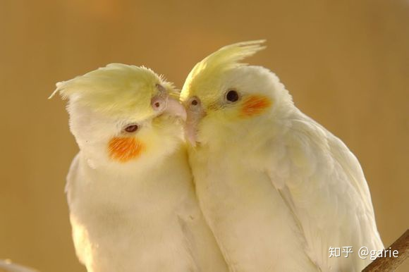
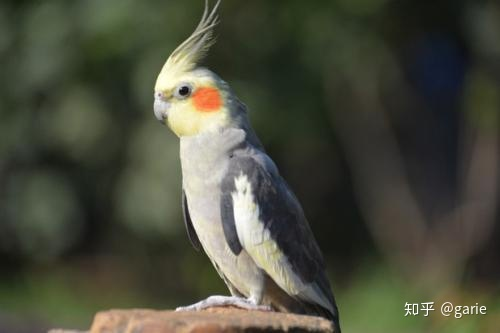
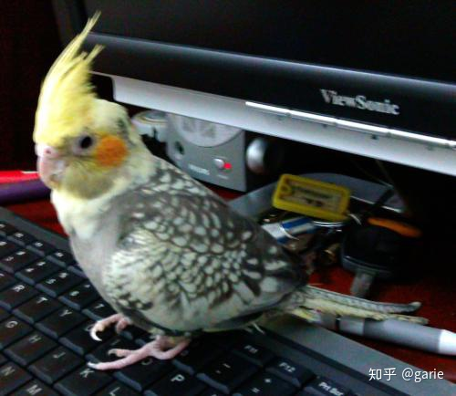
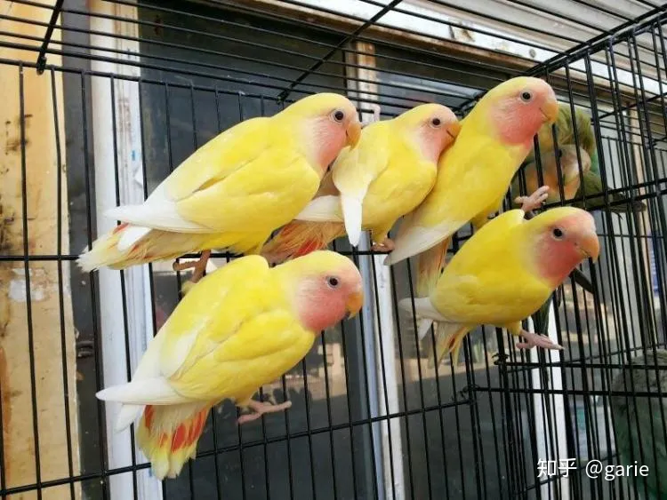
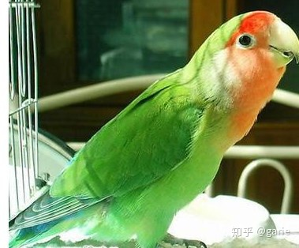
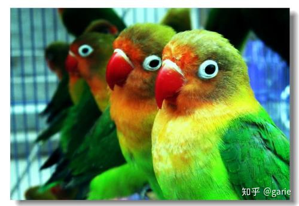
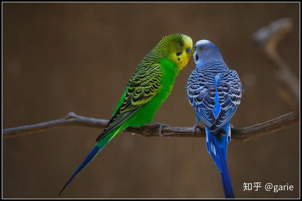
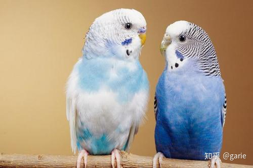

# 鹦鹉简介

鹦鹉是鹦形目（学名：Psittaciformes）众多羽毛艳丽、爱叫的[鸟](https://baike.baidu.com/item/鸟?fromModule=lemma_inlink)。典型的[攀禽](https://baike.baidu.com/item/攀禽/2021723?fromModule=lemma_inlink)，对趾型足，两趾向前两趾向后，适合抓握，鸟喙强劲有力，可以食用硬壳果。羽色鲜艳，常被作为宠物饲养。它们以其美丽的羽毛，善学人语技能的特点，更为人们所欣赏和钟爱。鹦鹉中体形最大的当属[紫蓝金刚鹦鹉](https://baike.baidu.com/item/紫蓝金刚鹦鹉/1227730?fromModule=lemma_inlink)，体长可达 100 厘米，最小的是[蓝冠短尾鹦鹉](https://baike.baidu.com/item/蓝冠短尾鹦鹉/6279661?fromModule=lemma_inlink) ，体长仅有 12 厘米。大多数鹦鹉主食树上或者地面上的植物果实、种子、坚果、浆果、嫩芽嫩枝等，兼食少量昆虫。吸蜜鹦鹉类则主食花粉、花蜜及柔软多汁的果实。鹦鹉类在世界各地都有分布。分布在温、亚热、热带的广大地域。种类非常繁多，有 2 科、82 属、358 种，是[鸟纲](https://baike.baidu.com/item/鸟纲/1194548?fromModule=lemma_inlink)最大的科之一。

在我们国家，家养鹦鹉合法只有三类分别是：玄凤鹦鹉、面类的牡丹鹦鹉、虎皮鹦鹉，下面来逐一介绍下优缺点。

# 家养鹦鹉简介

## 玄凤

玄凤鹦鹉 —又名鸡尾鹦鹉，头上有羽冠，长约 7 厘米左右，属于中小型鹦鹉，常见的颜色主要有三类：珍珠灰，原始灰和黄化。综合性格和颜值我认为选黄化会好一些，性格比较温和。成年后的公鹦鹉翅膀内侧斑点会消失，变成无斑点，母鹦鹉翅膀内侧一直有斑点。

​                                                                                                                     黄化

​                                                                                                                原始灰

​                                                                                                             珍珠灰

### 小视频

​       [玄凤鹦鹉破壳](https://www.bilibili.com/video/BV1fU4y1t7C5/?spm_id_from=autoNext)

​      [从0开始](https://www.bilibili.com/video/BV1z64y1d7XK/?spm_id_from=333.788.recommend_more_video.-1)

​       [说八百遍了，鹦鹉不要放卧室养！](https://www.bilibili.com/video/BV1xA411T7SK/?spm_id_from=333.337.search-card.all.click)

​     [放飞](https://www.bilibili.com/video/BV14s411u7jo/?spm_id_from=333.337.search-card.all.click)

​     [【鹦鹉】鸟中有善口技者](https://www.bilibili.com/video/BV1bb4y1d7XV/?spm_id_from=333.337.search-card.all.click)

​       [会吹口哨的玄凤鹦鹉 自己会切换曲子](https://www.bilibili.com/video/BV1bb4y1d7XV/?spm_id_from=333.337.search-card.all.click)

### 优点

- 亲人程度高，强烈建议买手养的，或者买幼崽手养（适合有时间有耐心的人）。笼养的由于长时间处于争食环境，性格凶悍，虽然会逐渐亲人，但无法根除咬人习惯，始终对主人有较强的警觉性。
- 性格安静胆小，很少刻意咬人和招惹其他鹦鹉（出于戒备和自卫的情况下除外），容易被其他种类的鹦鹉欺负 ，一般母的较凶。
- 母鹦鹉大多数声音悦耳，叫声单一。公鹦鹉音色多变，有些尖锐，能学吹多首口哨，性格好容易和人相处，因此公鹦鹉更推荐入手，主要原因是性格好容易和人相处。

### 缺点

- 羽毛质地粉粉的，容易掉细羽和粉状物，特别是抖翅膀的时候。饲养两只鸟则需要准备一个大的鸟笼，五六十块的方形笼即可，建议房间要通风良好或者长时间人不在，不要放在卧室，厨房，客厅。
- 由于具备一定的破坏力，建议把松木站杆替换成花椒木站杆，有效防止咬断站杆。
- 学语言方面，由于发音器官构造的原因，难以模仿人类语言。
- 社交能力差，两只玄凤鹦鹉如果不是从小一起长大，不易建立良好的关系，比较独立。
- 是个话痨，特别是成年以后，好在不会像牡丹的叫声让人烦躁。

### 总结

亲人程度突出，容易和人相处，是个加分项

推荐指数：★★★★★ 

### 饲养建议

请务必购买手养鸟，如果担心挂羊头卖狗肉的店铺，记住，第一点，一分钱一分货，第二点，仔细看评价。玄凤喜欢用鸟喙和人进行互动，手养鸟懂得控制咬人的力度，笼养鸟则不会，笼养鸟咬人非常影响饲养体验，不要想着用手养鸟来带动笼养鸟。玄凤如果没有大病应该能养五年以上，多花几十块，折合到每年也多不了多少钱。

## 牡丹鹦鹉 

牡丹鹦鹉 —又称为爱情鸟，属于小型鹦鹉，整体比虎皮鹦鹉大一圈，比玄凤鹦鹉小很多， 分为头类和面类，面类可以合法饲养。

常见的头类有费氏牡丹鹦鹉，常见的面类是黄桃和绿桃，费氏牡丹鹦鹉的特征是眼睛有白圈，嘴巴为红色。面类的特征是眼睛没有白圈，嘴巴一般为黄色。两者杂交则是骡子，骡子嘴巴带红色，一般情况下不能繁育，面类的经过人工繁育，性格较为温和。

​																												黄桃

​																												绿桃

​																												费氏牡丹

### 小视频

[【牡丹鹦鹉】会自己荡秋千的聪明小鸡](https://www.bilibili.com/video/BV1S94y1d7xJ/?spm_id_from=333.337.search-card.all.click)

[这肺活量没的说，10秒长啸。。。](https://www.bilibili.com/video/BV1uY4y1i7hU/?spm_id_from=333.788.recommend_more_video.-1)

### 优点

- 智商为三种鹦鹉里最高，运动和反应速度也是最快，性格活泼好动，警觉性高，欺软怕硬的典型，对待其他种类鹦鹉大打出手，对主人则是怕闪躲，一般来说面类更聪明。
- 尾巴短不容易脏，比较不易掉毛，毛质介于虎皮和玄凤之间，身体线条流畅，观赏性强。

### 缺点

- 不轻易亲人，和主人建立关系需要的时间长，但有些自养的很粘人。
- 性格活泼，攻击性强，不要和其他品种鹦鹉混养。虽然体型比玄凤小多了，但力气不小。
-  喜鸣叫，声音尖锐，会和人的耳膜产生共振，刚入手可能会安静个两三周，之后就会吵翻天，头类和面类的叫声有点不一样，头类的更难听一些。成年后反而安静一点。
-  有些鹦鹉可能是鸟喙大的缘故，不好控制，进食鸟粮容易撒出，有时候甚至可以浪费一半。
- 学语言或者吹口哨能力几乎没有。
- 不好辨别，特别是面类，除了验卡几乎无法辨认。
-  智商高逃跑能力较强，建议笼门用扣子扣住，窗户请关好再放出来。

### 总结

善于察言观色的小精灵，社会化程度较高，和人相处如履薄冰

推荐指数：★★★★ 

### 饲养建议

牡丹对其他鸟类的攻击性很强，为了避免造成残疾，建议切断和其他鸟类接触，特别是不长记性的虎皮。牡丹智商高，懂得趋利避害，一般不主动攻击人，不过母鸟（即使是手养）在进入繁殖期以后会变得很凶，在笼子里会有强烈的攻击行为，互动性有所下降，排泄量也会变得很大，注意做好卫生。

## 虎皮鹦鹉 

虎皮鹦鹉 —— 又名娇凤或者鹦哥 ，属于小型鹦鹉，性情活泼胆大且易于饲养，在中国是大众最喜欢最常见的宠物鸟之一。公鸟成年后鼻膜为蓝色，母鸟为棕色。成年以后头上的虎斑褪去，我们可以从日常观察中能发现公鸟好动一些，更喜欢在房间里到处走，比母鸟更容易亲人，咬人力度更轻。母鸟领地意识更强。

​                																				绿色为最常见的原始种

​																						         左边为人工培养种

### 小视频

​       [【虎皮鹦鹉说话】学渣背诗](https://www.bilibili.com/video/BV1nK4y187An/?spm_id_from=333.337.search-card.all.click)

​       [耗时 45 天，虎皮鹦鹉从鸟蛋到成年的成长全过程](https://www.bilibili.com/video/BV1di4y1w7ZW/?spm_id_from=autoNext)

### 优点

- 便宜，一般都是成对饲养，不会因为价格压力只考虑养一只。
- 身体素质好，不易生病，日常生活好打理，食谱也比其他鹦鹉简单。
- 具备说话能力，虽然是三种鹦鹉里面最强，但依然很有限，能成功说话的虎皮不多。
- 羽毛光滑柔顺，不太容易掉毛。

### 缺点

- 智商不高，特别是母鹦鹉，在某些情形下，虽然周围并没有安全威胁，依然会习惯性地对人发出攻击性动作。
- 虎皮虽小，生性好斗，就算从小养大的两只在一起也容易产生欺凌现象，更多时候是母鸟打公鸟，堪称家暴典范。
- 亲人程度有限，养不熟，一般对人始终保持一定的距离，特别是母鹦鹉，如果没有公鹦鹉在前面引导，基本上不会主动靠近。

### 总结

记性差，智商低，不懂规避危险是主要缺点，可以靠近人，但难以建立亲密关系。

推荐指数：★★★

### 饲养建议

智商不高且具有一定的攻击性是硬伤，也注定了大部分虎皮鹦鹉不会亲人，如果要养的话推荐不买常见的原始 4 色（绿白黄蓝）的普通种，可以考虑大头虎皮，相对安静，性格也比较温和。

# 鹦鹉饲养常识

- **笼舍**

  鹦鹉需在**铁笼**中饲养，因鹦鹉喜啃咬，所以**不能用**竹、木等材质的鸟笼，否则鸟笼很容易被啃破。

  鹦鹉生性活泼，饲养笼要选择**高大款专用鸟笼**；巢箱一般为木质两层结构，巢箱挂在笼外笼内均可；如需繁殖，可安置繁殖笼，其材质以金属丝为主，其大小大多为 65㎝×60㎝×50㎝。

  笼舍需放置于**通风处**，避免笼舍潮湿，对鹦鹉健康成长造成不利影响。

- **喂养**

    鹦鹉粮**不能过于单一**，需保持粮食的多样性，可用经过合理搭配**混合粮**喂食。具体混合粮配比如下：

  【蛋米比例】

    1 公斤小米加 4 个鸡蛋黄搅拌加热而成，占总喂养量约 **40%** 左右；

  【稻米比例】

    稻米可为鹦鹉补充淀粉、蛋白质、微量元素和多种维生素，还能增加喙的咀嚼能力，占总喂养量约 **30% 左右**；

  【谷物比例】

    一般占总喂养量的 **10%~15%**

  【其它】

  1. 可喂食葡萄、苹果果肉（**果核部分有毒**）、草莓以及黄瓜、胡萝卜、空心菜等**蔬菜水果作为零食**，但要适量。

  2. **营养沙**含有钙、铁及多种微量元素等营养成分，对鹦鹉骨骼健康及毛色都有所助益。

  3. **乌贼骨和鸡蛋壳**，是集补钙与玩具于一身的食物，可让鹦鹉在玩耍中补充部分钙质。

  4. 鹦鹉都爱吃**坚果等油料作物**，但要注意**适量**投喂，小心鹦鹉因吃太多而患上**脂肪肝、肥胖等疾病**。

