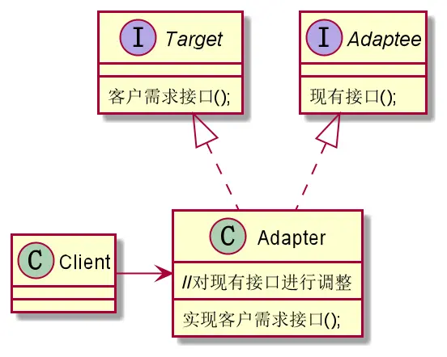
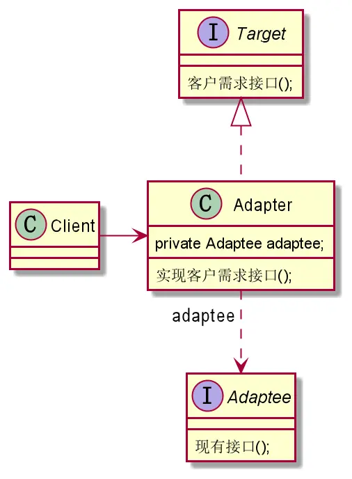
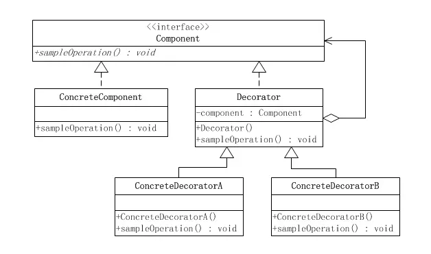
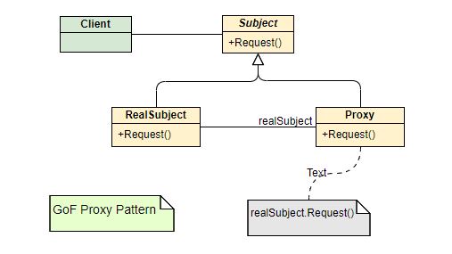

[TOC]

# 四大设计模式介绍

## 适配器设计模式

适配器模式（Adapter Pattern）是作为两个不兼容的接口之间的桥梁。这种类型的设计模式属于结构型模式，它结合了两个独立接口的功能。

### 设计意图

将一个类的接口转换成客户希望的另外一个接口，这就是适配器需要做的事情，适配器模式使得原本由于接口不兼容而不能一起工作的那些类可以一起工作。
在某些时候，客户期望获得某种功能接口但现有的接口无法满足客户的需求，例如美国的正常供电电压为 110V，一个中国人带了一款中国制造电器去美国，这个电器必须要在 220V 电压下才能充电使用。这种情况下，客户 (中国人) 的期望接口是有一个220V的电压为电器充电，但实际的接口是仅有一个110V的电压供电器充电，这种情况下就需要采用一根电压转换器 (适配器) 使得 110V 的电压能够转换为 220V 的电压，供客户使用。

### 适用场景

系统需要使用现有的类，而此类的接口不符合系统的需要 (核心需求)。
想要建立一个可以重复使用的适配器类，用于与一些彼此之间没有太大关联的一些类，包括一些可能在将来引进的类一起工作，这些源类不一定有一致的接口，但通过适配器使得它们都具有一致的接口。
通过接口转换，将一个类插入另一个类系中。（比如老虎和飞禽，现在多了一个飞虎，在不增加实体的需求下，增加一个适配器，在里面包容一个虎对象，实现飞的接口。）

### 类图介绍

通常有两种方式实现适配器模式，一种是类适配器，类适配器目前已不太使用，另一种实现方式是对象适配器，通常情况下采用对象适配器会使得代码更易扩展与维护。
不管采用何种方式，其基本的实现思想都是：对现有接口的实现类进行扩展，使其实现客户期望的目标接口。

类适配器通过继承现有接口类并实现目标接口，这样的话会使得现有接口类完全对适配器暴露，使得适配器具有现有接口类的全部功能，破坏了封装性。此外从逻辑上来说，这也是不符合常理的，适配器要做的是扩展现有接口类的功能而不是替代，类适配器只有在特定条件下会被使用。


对象适配器持有现有接口类一个实例，并扩展其功能，实现目标接口。这是推荐的方式，优先采用组合而不是继承，会使得代码更利于维护。此外，这也是非常符合常理的 ——“给我一根线，让我来给他加长到 5m，我并不需要知道这跟线是什么组成的，因为我的工作就是让线加长到 5m”—— 我们扩展了相应功能而并不关心其具体实现。



Target：客户期望获得的功能接口 (220V 电压供电)。
Cilent：客户，期望访问 Target 接口 (客户期望能有 220V 电压)。
Adaptee：现有接口，这个接口需要被适配 (现有 110V 电压供电，需要被适配至 220V)。
Adapter：适配器类，适配现有接口使其符合客户需求接口 (适配 110V 电压，使其变为 220V 电压)。

### 代码示例

类适配器实现：

```Java
//客户期望的接口——220V的电压充电
interface Target {
    void chargeBy220V();
}

//现有接口——只能通过110V电压充电
interface Adaptee {
    void chargeBy110V();
}

//现有接口的具体实现类，美国供电器——通过110V电压供电
class americanCharger implements Adaptee {
    @Override
    public void chargeBy110V() {
        System.out.println("美国供电器，只为你服务，正在通过110V电压为您充电");
    }
}

//类适配器，通过继承现有接口来完成对现有接口的扩展
class Adapter extends americanCharger implements Target {
    @Override
    public void chargeBy220V() {
        super.chargeBy110V();//现有功能
        System.out.println("再加110V，达到220V，冲鸭！");//对现有功能扩展
    }
}

//测试类
public class Test {
    public static void main(String[] args) throws FileNotFoundException {
        //类适配器使得代码逻辑混乱
        //这种情况下仿佛Adapter是一种110V的美国供电器可以直接使用不需要其他信息
        //具体可以和对象适配器对比以下
        new Adapter().chargeBy220V();
    }
}
```

对象适配器实现：

```Java
//客户期望的接口——220V的电压充电
interface Target {
    void chargeBy220V();
}

//现有接口——只能通过110V电压充电
interface Adaptee {
    void chargeBy110V();
}

//现有接口的具体实现类，美国供电器——通过110V电压供电
class americanCharger implements Adaptee {
    @Override
    public void chargeBy110V() {
        System.out.println("美国供电器，只为你服务，正在通过110V电压为您充电");
    }
}

//类适配器，通过继承现有接口来完成对现有接口的扩展，使得能够110V供电
class Adapter implements Target {
    Adaptee adaptee;//持有现有接口具体实现对象的引用

    public Adapter(Adaptee adaptee) {
        this.adaptee = adaptee;
    }

    @Override
    public void chargeBy220V() {
        adaptee.chargeBy110V();//该对象的现有功能
        System.out.println("再加110V，达到220V，冲鸭！");//对现有功能扩展
    }
}

//测试类
public class Test {
    public static void main(String[] args) throws FileNotFoundException {
        //现在我们有一个美国110V供电站，但我们无法使用
        Adaptee adaptee = new americanCharger();

        //我们将这个供电器交给适配器，适配器转换为220V供电器
        Adapter adapter = new Adapter(adaptee);

        //接下来我们通过适配器充电就好了
        adapter.chargeBy220V();        
    }
}
//输出同上

```

### 应用实例

1、美国电器 110V，中国 220V，就要有一个适配器将 110V 转化为 220V。 
2、JAVA JDK 1.1 提供了 Enumeration 接口，而在 1.2 中提供了 Iterator 接口，想要使用 1.2 的 JDK，则要将以前系统的 Enumeration 接口转化为 Iterator 接口，这时就需要适配器模式。
3、在 LINUX 上运行 WINDOWS 程序。
4、JAVA 中的 jdbc。

### 总结

优点：

- 可以让任何两个没有关联的类一起运行。
- 提高了类的复用，可以一致化多个不同接口。
- 将现有接口实现类隐藏，增加了类的透明度。
- 灵活性高，可自由适配。
  
缺点：

- 过多地使用适配器，会让系统非常零乱，不易整体进行把握。比如，明明看到调用的是 A 接口，其实内部被适配成了 B 接口的实现，一个系统如果太多出现这种情况，无异于一场灾难。因此如果不是很有必要，可以不使用适配器，而是直接对系统进行重构。
- 某些适配工作可能非常困难，例如让房子飞起来。

当我们有动机地修改一个正常运行的系统的接口，这时应该考虑使用适配器模式。
注意事项：适配器不是在详细设计时添加的，而是解决正在服役的项目的问题，即现有接口可能无法改变 (去美国不可能把人家 110V 电压供给改成 220V 电压供给)。

## 装饰器设计模式

亦称为: 装饰者模式、装饰模式、Wrapper、Decorator, 也是一种结构型设计模式，允许你通过将对象放入包含行为的特殊封装对象中来为原对象绑定新的行为。
装饰器模式以对客户端透明的方式拓展对象的功能，是继承关系的一种替代方案。

### 设计意图

装饰器模式以对客户透明的方式动态的给一个对象附加上更多的责任。换言之，客户端并不会觉得对象在装饰前和装饰后有什么不同。装饰器模式可以在不是用创造更多子类的情况下，将对象的功能加以拓展。

### 适用场景

在不想增加很多子类的情况下扩展类:

- 扩展一个类的功能
  
- 动态增加功能，动态撤销

### 类图介绍



在装饰器模式中的角色有：

- 抽象构件 (Component) 角色：给出一个抽象接口，已规范准备接收附加责任的对象。
- 具体构件 (ConcreteComponent) 角色：定义一个将要接收附加责任的类
- 装饰 (Decorator) 角色：持有一个构件 (Component) 对象的实例，并定义一个与抽象构件接口一致的接口。
- 具体装饰 (ConcreteDecorator) 角色：负责给构件对象 “贴上” 附加的责任。

### 代码示例

孙悟空有七十二般变化，他的没一种变化都给他带来一种附加的本领。他变成鱼儿时，就已到水里游泳；他变成鸟儿时，就可以在天上飞行。
本例中，Component 的角色便是由大名鼎鼎的齐天大圣扮演；ConcreteComponent 的角色属于大圣的本尊，就是猢狲本人；Decorator 的角色由大圣的七十二变扮演。而 ConcreteDecorator 的角色就是鱼儿、鸟儿等七十二般变化。

```Java

// 抽象构件角色 “齐天大圣” 接口
public interface TheGreatestSage {
    public void move();
}

// 具体构件角色 “大圣本尊”
public class Monkey implements TheGreatestSage {
    @Override
    public void move() {
        System.out.println("Monkey move");
    }
}

// 抽象装饰角色 “七十二变”
public class Change implements TheGreatestSage {
    private TheGreatestSage sage;
    
    public Change(TheGreatestSage sage) {
        this.sage = sage;
    }
    @Override
    public void move() {
        this.sage.move();
    }
}

// 具体装饰角色，“鱼儿” 
public class Fish extends Change {
    public Fish(TheGreatestSage sage) {
        super(sage);
    }
    
    @Override
    public void move() {
        super.move();
        System.out.println("Change fish move");
    }
}

// 具体装饰角色，“鸟儿”
public class Bird extends Change {
    public Bird(TheGreatestSage sage) {
        super(sage);
    }
    
    @Override
    public void move() {
        super.move();
        System.out.println("Change bird move");
    }
}

// 客户端
public class Client {
    public static void main(String[] args) {
        TheGreatestSage sage = new Monkey();
        TheGreatestSage fish = new Fish(new Bird(sage));
        fish.move();
    }
}

```

### 应用实例

- JAVA I/O 标准库的设计
  - 抽象构建角色 (Component)：由 InputStream 扮演。这是一个抽象类，为各种子类型提供统一的接口。
  - 具体构件角色 (ConcreteComponent)：由 ByteArrayInputStream、FileInputStream、StringBufferInputStream 等类扮演。它们实现了抽象构件角色所规定的接口。
  - 抽象装饰角色 (Decorator)：由 FilterInputStream、ObectInputStream 等类扮演。它们实现了 InputStream 所规定的接口。
  - 具体装饰角色 (ConcreteDecorator)：由几个类扮演，分别是 BufferedInputStream、DataInputStream 以及两个不常用到的类 LineNumberInputStream、PushbackInputStream。

### 总结

优点: 装饰类和被装饰类可以独立发展，不会相互耦合，装饰模式是继承的一个替代模式，装饰模式可以动态扩展一个实现类的功能。
缺点: 多层装饰比较复杂。

装饰器模式通过嵌套包装多个装饰器对象，可以实现多层次的功能增强。每个具体装饰器类都可以选择性地增加新的功能，同时保持对象接口的一致性。

## 门面设计模式

门面设计，也称外观模式（Facade Pattern），用于隐藏系统的复杂性，并向客户端提供了一个客户端可以访问系统的接口。这种类型的设计模式属于结构型模式，它向现有的系统添加一个接口，来隐藏系统的复杂性。
这种模式涉及到一个单一的类，该类提供了客户端请求的简化方法和对现有系统类方法的委托调用。其实，在日常编码工作中，我们都在有意无意地大量使用门面模式。但凡只要高层模块需要调度多个子系统 (2 个以上类对象)，我们都会自觉地创建一个新类封装这些子系统，提供精简的接口，让高层模块可以更加容易地间接调用这些子系统的功能。

### 设计意图

现代的软件系统都非常复杂，尽管我们已经想尽一切方法将其 “分而治之”，把一个系统划分为好几个较小的子系统了，但是仍然可能会存在这样的问题：子系统内有非常多的类，客户端往往需要和许多对象打交道之后 才能完成想要完成的功能。
现实生活中，一般的医院都会分为挂号、门诊、化验、收费、取药等。看病的病人要想治好自己的病（相当于一个客户端想要实现自己的功能）就要和医院的各个部门打交道。首先，病人需要挂号，然后门诊，如果医生要求化验的话，病人就要去化验，然后再回到门诊室，最后拿药，经过一系列复杂的过程后才能完成看病的过程。
解决这种不便的方式就是引入门面模式。如果我们在医院设立一个接待员的话，病人只负责和接待员接触，由接待员负责与医院的各个部门打交道。

### 适用场景

客户端不需要知道系统内部的复杂联系，整个系统只需提供一个 "接待员" 即可：在客户端和复杂系统之间再加一层，这一层将调用顺序、依赖关系等处理好。
1、当要为一个复杂子系统提供一个简单接口时可以使用外观模式。该接口可以满足大多数用户的需求，而且用户也可以越过外观类直接访问子系统。
2、客户程序与多个子系统之间存在很大的依赖性。引入外观类将子系统与客户以及其他子系统解耦，可以提高子系统的独立性和可移植性。
3、在层次化结构中，可以使用外观模式定义系统中每一层的入口，层与层之间不直接产生联系，而通过外观类建立联系，降低层之间的耦合度。

### 代码示例

```Java
// 子系统A
public class ServiceA { 
    public void doA(){ 
        System.out.println("do ServiceA"); 
    } 
} 
// 子系统B
public class ServiceB { 
    public void doB(){ 
        System.out.println("do ServiceB"); 
    } 
} 
// 子系统C
public class ServiceC { 
    public void doC(){ 
        System.out.println("do ServiceC"); 
    } 
    public void doCUp(){ 
        System.out.println("do ServiceC"); 
    } 
} 

// 门面
public class Facade { 
    private ServiceA serviceA = new ServiceA(); 
    private ServiceB serviceB = new ServiceB(); 
    private ServiceC serviceC = new ServiceC(); 
 
    public void doA() { 
        serviceA.doA(); 
    } 
 
    public void doB() { 
        serviceB.doB(); 
    } 
 
    public void doC() { 
        serviceC.doC(); 
    } 
} 
```

### 应用实例

1、去医院看病，可能要去挂号、门诊、划价、取药，让患者或患者家属觉得很复杂，如果有提供接待人员，只让接待人员来处理，就很方便。 
2、去银行办理业务，有个前台接待你，然后，这个前台会问你需要办什么业务，他会一个一个带你办理，这样我们就不需要到处乱串、到处找对应业务窗口了。这个前台人员就相当于门面模式。
3、我们建房子，如果没有包工头的话，那就是你自己要去找水泥工，电工、装修工等。但如果有了包工头，这些活你都不用干了，直接跟包工头说，需要电工来把线路搞好。这个包工头就可以理解为门面模式。
4、我们后端开发的 controller，也可以理解为门面模式，比如说获取用户账户信息，先查 UserService 获取用户信息，然后查 UserAccountService 用户账户信息。

### 总结

优点：

- 对客户屏蔽子系统组件，减少了客户处理的对象数目并使得子系统使用起来更加容易。通过引入门面模式，客户代码将变得很简单，与之关联的对象也很少。
- 实现了子系统与客户之间的松耦合关系，这使得子系统的组件变化不会影响到调用它的客户类，只需要调整外观类即可。
- 降低了大型软件系统中的编译依赖性，并简化了系统在不同平台之间的移植过程，因为编译一个子系统一般不需要编译所有其他的子系统。一个子系统的修改对其他子系统没有任何影响，而且子系统内部变化也不会影响到外观对象。
- 只是提供了一个访问子系统的统一入口，并不影响用户直接使用子系统类。
  
缺点：

- 不能很好地限制客户使用子系统类，如果对客户访问子系统类做太多的限制则减少了可变性和灵活性。
- 在不引入抽象外观类的情况下，增加新的子系统可能需要修改外观类或客户端的源代码，违背了 “开闭原则”。


## 代理设计模式

在代理模式（Proxy Pattern）中，一个类代表另一个类的功能。这种类型的设计模式属于结构型模式。
在代理模式中，我们创建具有现有对象的对象，以便向外界提供功能接口。

### 设计意图

为其他对象提供一种代理以控制对这个对象的访问。

### 适用场景

在直接访问对象时带来的问题，比如说：要访问的对象在远程的机器上。在面向对象系统中，有些对象由于某些原因（比如对象创建开销很大，或者某些操作需要安全控制，或者需要进程外的访问），直接访问会给使用者或者系统结构带来很多麻烦，我们可以在访问此对象时加上一个对此对象的访问层，即想在访问一个类时做一些控制。

### 类图介绍



Subject: 定义 RealSubject 对外的接口，且这些接口必须被 Proxy 实现，这样外部调用 proxy 的接口最终都被转化为对 realsubject 的调用。
RealSubject: 真正的目标对象。
Proxy: 目标对象的代理，负责控制和管理目标对象，并间接地传递外部对目标对象的访问。

### 代码示例

```Java
// 定义公共接口类 Server:
public interface Server{
    void visit(String url);
}

//代理服务器 ProxyServer:
public class ProxyServer implements Server{
 
   private RealServer realServer;

   public ProxyServer(String serverName){
      this.realServer = new RealServer(serverName);
   }
 
   @Override
   public void visit(String url) {
      realServer.visit(url);
   }
}

// 目标服务器
public class RealServer implements Server {
    private String serverName;
    public RealServer(String serverName) {
        this.serverName = serverName;
        System.out.println("This is " + serverName);
    }
    
    @Override
    public void visit(String url) {
        response(url);
    }
    
    private void response(String res) {
        System.out.println("This is response of " + res + " from server:" + serverName);
    }
}

// 客户端调用
public class Demo {
    public static void main(String[] args) {
        Server server = new ProxyServer("www.google.com");
        server.visit("map.google.com");
    }
}
```

### 应用实例

1、Windows 里面的快捷方式
2、猪八戒去找高翠兰结果是孙悟空变的，可以这样理解：把高翠兰的外貌抽象出来，高翠兰本人和孙悟空都实现了这个接口，猪八戒访问高翠兰的时候看不出来这个是孙悟空，所以说孙悟空是高翠兰代理类
3、买火车票不一定在火车站买，也可以去代售点
4、一张支票或银行存单是账户中资金的代理。支票在市场交易中用来代替现金，并提供对签发人账号上资金的控制
5、spring aop。

### 总结


# 四大设计模式对比

Adapter（适配器）、Decorator（装饰器）、Facade（门面） 和 Proxy（代理） 设计模式之间有一些惊人的相似之处，因为它们都使用组合和委托来解决问题。 

- 适配器模式包装一个接口，并将调用委托给它。 
- 装饰器包装一个对象并在其之上实现行为。
- Facade 包装一个或多个接口以提供一个易于使用的中央接口。
- 代理模式还包装 Subject 并委托对它的调用。 

那么问题来了，为什么会有不同的模式呢？ Adapter、Decorator、Facade 或 Proxy 模式之间的区别是什么，如果它们的结构相同。 答案是目的。 是的，所有这些 Java 设计模式都有相似的结构和类图，但它们的**目的**却完全不同。

- 适配器模式的主要目的是转换接口。适配器模式让两个组件一起工作，因为不兼容的接口而无法工作。
  
- 装饰器模式，在运行时添加新功能。它允许我们丰富对象，即使是在对象创建之后。
门面设计模式既不转换接口也不增加新的功能，而只是提供更简单的接口。因此，客户端不是直接访问系统的各个组件，而是使用门面。 

- 门面设计模式允许客户以更简单的界面和更少的工作与复杂的系统进行交互。然后门面将调用各个组件。
  
- 代理模式也与适配器和装饰器非常相似，但其目的是控制对象的访问。代理阻止客户端直接访问对象，而是作为一个真实的对象，可以提供替代行为或将请求转发给原始对象。代理是所有这些模式中最通用的模式，它可以以不同的方式使用，例如用于与远程对象通信的远程代理、用于控制昂贵对象访问的虚拟代理、基于角色提供对对象的访问的保护代理、缓存代理，它可以返回缓存的对象等。

## 相似之处

主要的相似之处之一是结构，所有这些模式都包装一个对象并委托请求处理或方法调用给它们。这里还有一些东西，这是所有这些模式之间的共同点。

- 在经典设计模式中，它们都被定义为结构模式，如 GOF 设计模式。
- 他们都使用组合和委托来实现他们的意图。 适配器使用组合将调用从目标接口转发到 adaptee 接口，装饰器在添加新行为之前也使用相同的技术，Facade 由所有子组件组成，代理也使用组合和委托来转发请求。
- 装饰器和代理模式都意味着停留在原始对象的位置，这就是为什么 装饰器和代理模式都实现了真实对象的接口。 由于这种性质，可以将装饰器和代理传递给接受原始或真实对象的方法。
- 适配器和门面模式，将请求转发到不同的接口，该接口可以是适配器或来自子系统的任何组件接口。
- 适配器和门面模式的另一个相似点是它们可以包装多个接口，这也不同于 装饰器和代理模式，因为它们倾向于对一个对象进行操作。

## 差异之处

这些结构模式之间虽然有很多相似之处，但是它们的意图、解决的问题以及使用它们的位置不同。

- 适配器模式转换接口，装饰器模式不转换接口，它只是实现原始对象的接口，这样它就可以传递给一个接受原始对象的方法。 门面和代理模式也不转换接口。装饰模式和适配器模式都是 “包装模式 (Wrapper Pattern)”，它们都是通过封装其他的对象达到设计的目的的，但是它们的形态有很多区别。理想的装饰模式在对被装饰的对象进行功能增强的同时，要求具体构件角色、装饰角色的接口与抽象构件角色的接口完全一致。而适配器模式则不然，一般而言，适配器模式并不要求对源对象的功能进行增强，但是会改变源对象的接口，以便和目标接口相吻合。

- 装饰器和代理模式之间的主要区别之一是装饰器从不创建对象，它总是在已经存在的对象上添加新功能，另一方面，代理可以创建一个不存在的对象。 它可以代替一个真实的对象，直到它准备好，然后开始向它转发请求。

- 适配器模式主要改变所考虑对象的接口，而代理模式不能改变所代理类的接口。装饰器模式为了增强功能，而代理模式是为了加以控制。
  
- 装饰器设计模式还允许添加多个功能，并且可以通过链接多个装饰器以有序的方式进行，而代理模式不建议代理链接。
- 如果我们比较装饰器和门面模式，那么你可以看到与装饰器不同，门面不添加任何新的行为，它只是从接口调用现有的方法，它作为一个门面提供。
- 与装饰器、代理和适配器设计模式不同，门面不需要实现任何特定的接口。 事实上，门面甚至可以是一个类，只是持有各个子系统组件并提供客户端所需的更简单的操作，然后在子系统上调用相应的方法。例如，我们可以将 Car 视为门面，它提供了启动和停止的 start() 和 stop() 方法。 当客户端调用 start() 方法时，它可能会通过调用相应的方法来启动各个子系统，例如 engine.start(), wheels.move(), lights.on(), ac.on() 等。

## 总结

简而言之:

- 如果需要转换接口，请使用适配器设计模式，使两方协同工作。
- 如果由于各种原因需要隐藏真实对象，则应该在 Java 中使用代理设计模式，例如 安全、性能、网络等。
- 使用装饰器模式在运行时在现有对象上添加新行为，它提供了混合行为并根据客户要求以不同顺序应用它们的灵活性。
- 最后使用门面模式为客户端提供复杂系统的简化访问。 门面提供了更高层次的抽象，应该包含客户端所需的操作.