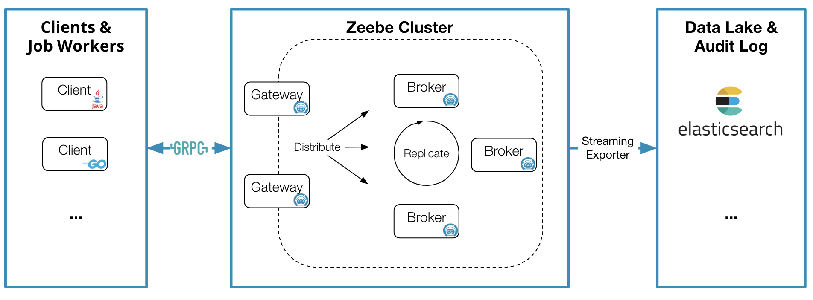
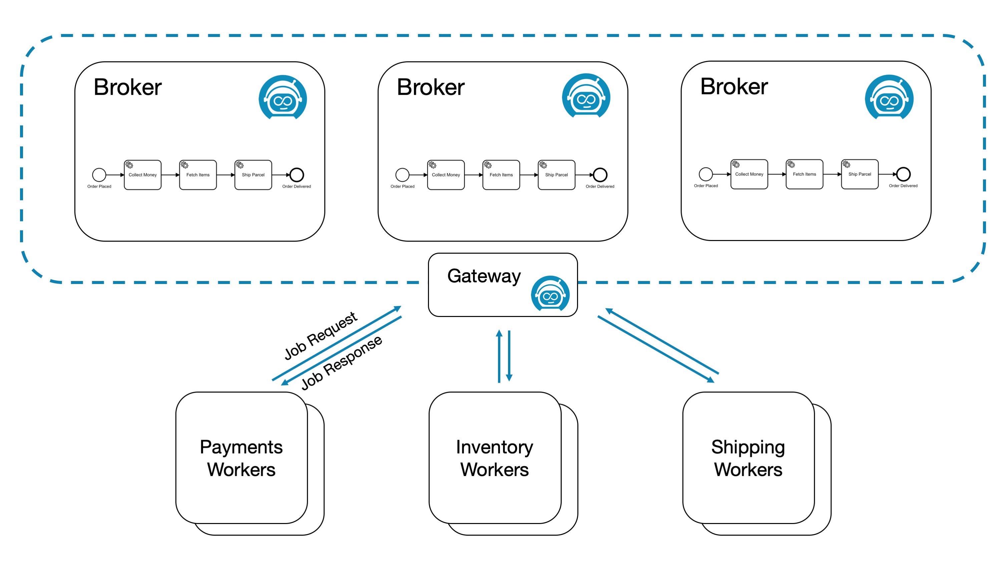
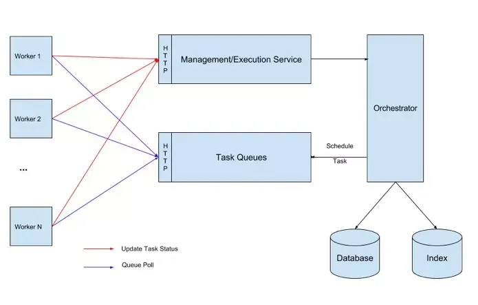
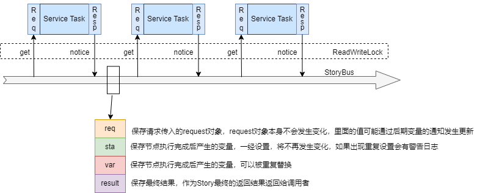
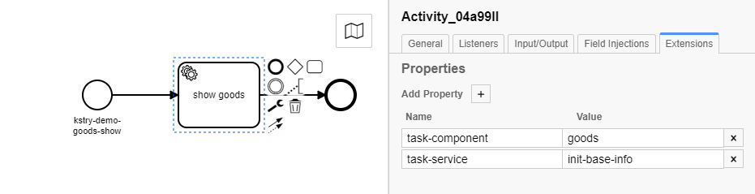

[TOC]

# Zeebe

## 基本介绍

[Zeebe](https://docs.camunda.io/docs/0.26/components/zeebe/deployment-guide/getting-started/)是一个用于微服务编排的开源工作流引擎。在Camunda基于BPMN2.0工作流基础上衍生出来的，设计很灵活，不需要依赖后端的存储，支持复制、分片（借鉴了kafka），支持同步和异步发起流程，它提供了：

- 可见性 (visibility)：Zeebe 提供能力展示出企业工作流运行状态，包括当前运行中的工作流数量、平均耗时、工作流当前的故障和错误等；
- 工作流编排 (workflow orchestration)：基于工作流的当前状态，Zeebe 以事件的形式发布指令 (command)，这些指令可以被一个或多个微服务消费，确保工作流任务可以按预先的定义流转；
- 监控超时 (monitoring for timeouts) 或其他流程错误：同时提供能力配置错误处理方式，比如有状态的重试或者升级给运维团队手动处理，确保工作流总是能按计划完成。
为了应对超大规模，Zeebe 支持：

- 横向扩容 (horizontal scalability)：Zeebe 支持横向扩容并且不依赖外部的数据库，相反的，Zeebe 直接把数据写到所部署节点的文件系统里，然后在集群内分布式的计算处理，实现高吞吐；
- 容错 (fault tolerance)：通过简单配置化的副本机制，确保 Zeebe 能从软硬件故障中快速恢复，并且不会有数据丢失；
- 消息驱动架构 (message-driven architecture)：所有工作流相关事件被写到只追加写的日志 (append-only log) 里；
- 发布 - 订阅交互模式 (publish-subscribe interaction model)：可以保证连接到 Zeebe 的微服务根据实际的处理能力，自主的消费事件执行任务，同时提供平滑流量和背压的机制；
- BPMN2.0 标准 (Visual workflows modeled in ISO-standard BPMN 2.0)：保证开发和业务能够使用相同的语言协作设计工作流；
- 语言无关的客户端模型 (language-agnostic client model)：可以使用任何编程语言构建 Zeebe 客户端。

Zeebe架构主要包含 4 大组件：client, gateway, brokers 以及 exporters:


- Client
嵌入到应用程序 (执行业务逻辑的微服务) 的库,可以完全独立于 Zeebe 扩缩容，用于跟 Zeebe 集群连接通信。客户端通过基于 HTTP/2 协议的 gRPC 与 Zeebe gateway 连接, 可用于：
  - 部署流程
  - 处理业务逻辑
  - 可以集成到各种语言项目中进行使用
  Client 中，执行单独任务的单元叫 JobWorker。
JobWorker定期请求某种类型的工作（即轮询）。此间隔和请求的作业数量可在 Zeebe 客户端中配置。如果请求类型的一项或多项作业可用，则 Zeebe会将激活的作业流式传输给工作人员。接收到作业后，JobWorker执行它们，并根据作业是否可以成功完成，为每个作业发回完成或失败命令。
许多JobWorker可以请求相同的工作类型，以扩大加工规模。在这种情况下，Zeebe 确保每个作业仅发送给其中一个JobWorker。此类作业被视为已激活，直到作业完成、失败或作业激活超时。


- Gateway：
  - zeebe集群的统一入口点，将请求转发给代理
  - 网关是无状态的，可以根据需要添加网关，以实现负载平衡和高可用性
- Broker：
Broker 是分布式的流程引擎，维护运行中流程实例的状态。Brokers 可以分区以实现横向扩容、副本以实现容错。通常情况下，Zeebe 集群都不止一个节点。broker 不包含任何业务逻辑，它只负责：
  - 处理客户端发送的指令
  - 存储和管理运行中流程实例的状态
  - 分配任务给 job workers
Brokes 形成一个对等网络 (peer-to-peer)，这样集群不会有单点故障。集群中所有节点都承担相同的职责，所以一个节点不可用后，节点的任务会被透明的重新分配到网络中其他节点。

- Exporter: 提供 Zeebe 内状态变化的事件流。这些事件流数据有很多潜在用处，包括但不限于：
  - 监控当前流程的执行状态
  - 分析历史工作流数据，用于审计、商业使用
  - Zeebe异常追踪

- 额外的扩展组件：
  - Modeler：一个创建和编辑BPMN可视化工具。可以远程运行、部署BPMN文件
  - Operate：一个监控Zeebe流程执行的可视化工具
  - Tasklist：是一个在Zeebe中处理用户任务的工具。您可以过滤、声明和完成用户任务。

## 代码示例

```Java

// 1、创建和gateway交互的client
final String gatewayAddress = System.getenv("ZEEBE_ADDRESS");
final ZeebeClient client =
            ZeebeClient.newClientBuilder()
                .gatewayAddress(gatewayAddress)
                .build();

// 2、使用client部署工作流程
final DeploymentEvent deployment = client.newDeployCommand()
            .addResourceFromClasspath("order-process.bpmn")
            .send()
            .join();    

// 3、创建工作流实例
final Map<String, Object> data = new HashMap<>();
        data.put("orderId", 31243);
        data.put("orderItems", Arrays.asList(435, 182, 376));
final WorkflowInstanceEvent wfInstance = client.newCreateInstanceCommand()
    .bpmnProcessId("order-process")
    .latestVersion()
    .variables(data) // data 为流程实例上下文参数
    .send()
    .join();

// 4、创建JobWorker接收类型为“payment-service”的执行任务
// “payment-service” 为“order-proces”流程中的任务节点
final JobWorker jobWorker = client.newWorker().jobType("payment-service")
    .handler((jobClient, job) ->
    {
        final Map<String, Object> variables = job.getVariablesAsMap();

        System.out.println("Process order: " + variables.get("orderId"));
        double price = 46.50;
        System.out.println("Collect money: $" + price);

        final Map<String, Object> result = new HashMap<>();
        result.put("totalPrice", price);

        jobClient.newCompleteCommand(job.getKey())
            .variables(result)
            .send()
            .join();
    })
    .fetchVariables("orderId")
    .open();
```

## 总结

由上可知，Zeebe 是有中心控制的编制(Orchestration)模式，进行微服务编排时，各个微服务引入Client包后，由Broker进行统一的协调调度，来完成单个流程实例的执行。其为超大规模分布式微服务而设计，可通过横向扩容来应对高并发场景的挑战；同时基于状态机的方式记录了单个流程实例的执行情况，为流程执行提供了可监控的抓手。但是由于是中心化设计，流程发起方通过向Zeebe发起流程执行的请求，而由Zeebe间接取进行流程图中各个Job的分发和结果的收集聚合，不可避免存在一些性能损耗。

# Conductor

## 简介

netflix conductor 是基于 JAVA 语言编写的开源流程引擎，用于架构基于微服务的流程。它具备如下特性：

- 允许创建复杂的业务流程，流程中每个独立的任务都是由一个微服务所实现。
- 基于 JSON DSL 创建工作流，对任务的执行进行编排。
- 工作流在执行的过程中可见、可追溯。
- 提供暂停、恢复、重启等多种控制模型。
- 提供一种简单的方式来最大限度重用微服务。
- 拥有扩展到百万流程并发运行的服务能力。
- 通过队列服务实现客户端与服务端的分离。
- 支持 HTTP 或其他 RPC 协议进行数据传送

## 整体架构

主要分为几个部分：

- Orchestrator: 负责流程的流转调度工作；
- Management/Execution Service: 提供流程、任务的管理更新等操作；
- TaskQueues: 任务队列，Orchestrator 解析出来的待执行 Task 会放到队列中；
- Worker: 任务执行 worker，从 TaskQueues 中获取任务，通过 Execution Service 更新任务状态与结果数据；
- Database: 元数据 & 运行时数据库，用于保存运行时的 Workflow、Task 等状态信息，以及流程任务定义的等原信息；
- Index: 索引数据库，用于存储执行历史；

## 基本概念

### Task

Task 是最小执行单元，承载了一段执行逻辑，如发送 HTTP 请求等。

- System Task：被 conductor 服务执行，这些任务的执行与引擎在同一个 JVM 中。
- Worker Task：被 worker 服务执行，执行与引擎隔离开，worker 通过队列获取任务后，执行并更新结果状态到引擎。Worker 的实现是跨语言的，其使用 Http 协议与 Server 通信。
conductor 提供了若干内置 SystemTask:

   - 功能性 Task：
   - HTTP：发送 http 请求
   - JSON_JQ_TRANSFORM：jq 命令执行，一般用户 json 的转换，具体可见 jq 官方文档
   - KAFKA_PUBLISH: 发布 kafka 消息
  
- 流程控制 Task：
  
  - SWITCH（原 Decision）：条件判断分支，类似于代码中的 switch case
  - FORK：启动并行分支，用于调度并行任务
  - JOIN：汇总并行分支，用于汇总并行任务
  - DO_WHILE：循环，类似于代码中的 do while
  - WAIT：一直在运行中，直到外部时间触发更新节点状态，可用于等待外部操作
  - SUB_WORKFLOW：子流程，执行其他的流程
  - TERMINATE：结束流程，以指定输出提前结束流程，可以与 SWITCH 节点配合使用，类似代码中的提前return语句
 - 自定义 Task：
   - 对于 System Task，Conductor 提供了 WorkflowSystemTask 抽象类，可以自定义扩展实现。
   - 对于 Worker Task，可以实现 conductor 的 client Worker 接口实现执行逻辑。

### Workflow

Workflow 由一系列需要执行的 Task 组成，conductor 采用 json 来描述 Task 的流转关系。
除基本的顺序流程外，借助内置的 SWITCH、FORK、JOIN、DO_WIHLE、TERMINATE 任务，还能实现分支、并行、循环、提前结束等流程控制。

### Input&Output

Task 的输入是一种映射，其作为工作流实例化的一部分或某些其他 Task 的输出。允许将来自工作流或其他 Task 的输入 / 输出作为随后执行的 Task 的输入。
Task 有自己的输入和输出，输入输出都是 jsonobject 类型。
Task 可以引用其他 Task 的输入输出，使用 ${taskxxx.output} 的方式引用。引用语法为 json-path，除最基础的 ${taskxxx.output} 的值解析方式外，还支持其他复杂操作，如过滤等，具体见 json-path 语法。
启动 Workflow 时可以传入流程的输入数据，Task 可以通过 ${workflow.input} 的方式引用。
Task 实现原子操作的处理以及流程控制操作，Workflow 定义描述 Task 的流转关系，Task 引用 Workflow 或者其它 Task 的输入输出。通过这些机制，conductor 实现了 JSON DSL 对流程的描述。


# kstry
## 简介

[kstry](http://kstry.cn/doc)是流程编排框架、并发框架、微服务业务整合框架。可以将原本存在于代码中错综复杂的方法调用关系以可视化流程图的形式更直观的展示出来，并提供了将所见的方法节点加以控制的配置手段。框架不能脱离程序执行之外存在，只能在方法与方法的调用中生效和使用，比如某个接口的一次调用。不会像Activiti、Camunda等任务流框架一样，脱离程序执行之外将任务实例存储和管理。不同使用场景中，因其发挥作用的不同，可以理解成不同的框架，Kstry 是：
- 【流程编排框架】提供所见（ 流程图示 ）即所得（ 代码执行 ）的可视化能力，可自定义流程协议，支持流程配置的热部署
- 【并发框架】可通过极简操作将流程从串行升级到并行，支持任务拆分、任务重试、任务降级、子任务遍历、指定流程或任务的超时时间
- 【微服务业务整合框架】支持自定义指令和任务脚本，可负责各种基础能力组件的拼装
- 【轻量的 TMF2.0 (opens new window)框架】可以通过以下三个步骤来满足同一接口下各类业务对实现功能的不同诉求：抽象能力资源、定义并将抽象出的能力资源授权给业务角色、同一流程的不同场景可分别匹配不同角色再将其下的能力资源任务加以执行
kstry的核心逻辑


## 使用示例

- 编写组件代码
  
``` Java
@TaskComponent(name = "goods")
public class GoodsService {
    
	@NoticeResult
    @TaskService(name = "init-base-info")
    public GoodsDetail initBaseInfo(@ReqTaskParam(reqSelf = true) GoodsDetailRequest request) {
        return GoodsDetail.builder().id(request.getId()).name("商品").build();
    }
}

```

- 定义流程图



- 执行流程

```Java

StoryRequest<GoodsDetail> req = ReqBuilder.returnType(GoodsDetail.class).startId("kstry-demo-goods-show").request(request).build();
TaskResponse<GoodsDetail> fire = storyEngine.fire(req);
if (fire.isSuccess()) {
    return fire.getResult();
}
```


# LiteFlow

## 简介

[LiteFlow](https://liteflow.cc/pages/5816c5/)是一个非常强大的现代化的规则引擎框架，融合了编排特性和规则引擎的所有特性。可用于复杂的组件化业务的编排领域，独有的 DSL 规则驱动整个复杂业务，并可实现平滑刷新热部署，支持多种脚本语言规则的嵌入。帮助系统变得更加丝滑且灵活。

LiteFlow 适用于拥有复杂逻辑的业务，比如说价格引擎，下单流程等，这些业务往往都拥有很多步骤，这些步骤完全可以按照业务粒度拆分成一个个独立的组件，进行装配复用变更。使用 LiteFlow，你会得到一个灵活度高，扩展性很强的系统。因为组件之间相互独立，也可以避免改一处而动全身的这样的风险。

## 使用示例
- 定义组件
  
```Java
@LiteflowComponent("b")
public class Bnode extends NodeComponent {

    @Override
    public void process() throws Exception {
        Book contextBean = this.getContextBean(Book.class);
        contextBean.setName("my");
        System.out.println(">>>>>>>Bnode 被调用了。。。。。"+ this.getRequestData()  +"oooooooooooooooooooooooo" + contextBean);
    }
}

@LiteflowComponent("c")
public class Cnode extends NodeComponent {

    @Override
    public void process() throws Exception {
        System.out.println(">>>>>>>Cnode 被调用了。。。。。"+ this.getRequestData()  +">>>>" +this.getContextBean(Book.class));
    }
}

```

- 编写规则文件

```xml
<?xml version="1.0" encoding="UTF-8"?>
<!DOCTYPE flow PUBLIC  "liteflow" "liteflow.dtd">
<flow>
    <chain name="chain1">
        THEN(a, b, c);
    </chain>
</flow>
```

- 执行流程
```Java
@SpringBootTest
class SimonkingLiteflowApplicationTests {

    @Resource
    private FlowExecutor flowExecutor;

    @Test
    void contextLoads() {
        Book book = new Book();
        book.setName("wsss:" + Thread.currentThread().getName());
        LiteflowResponse response = flowExecutor.execute2Resp("chain1", "arg****************", book);
        System.out.println("response:" + JSON.toJSONString(response));
    }
}
```


# Compileflow
[compileflow](https://github.com/alibaba/compileflow/blob/master/README_CN.md) 是一个非常轻量、高性能、可集成、可扩展的流程引擎。
compileflow Process 引擎是淘宝工作流 TBBPM 引擎之一，是专注于纯内存执行，无状态的流程引擎，通过将流程文件转换生成 java 代码编译执行，简洁高效。当前是阿里业务中台交易等多个核心系统的流程引擎。
compileflow 能让开发人员通过流程编辑器设计自己的业务流程，将复杂的业务逻辑可视化，为业务设计人员与开发工程师架起了一座桥梁。
功能列表:

- 高性能：通过将流程文件转换生成 java 代码编译执行，简洁高效。
- 丰富的应用场景：在阿里巴巴中台解决方案中广泛使用，支撑了导购、交易、履约、资金等多个业务场景。
- 可集成：轻量、简洁的设计使得可以极其方便地集成到各个解决方案和业务场景中。
- 完善的插件支持：流程设计目前有 IntelliJ IDEA、Eclipse 插件支持，可以在流程设计中实时动态生成 java 代码并预览，所见即所得。
- 支持流程设计图导出 svg 文件和单元测试代码。
- 支持基于 Java 反射和 Spring 容器的代码触发
