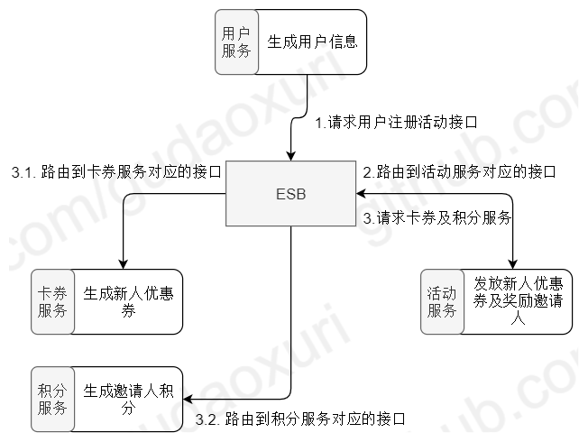

[TOC]

# 何为编排

在计算机科学和软件工程中，"编排"是指协调和管理多个独立组件或服务，以实现特定的业务流程或工作流程。它涉及到在一个整体系统中将各个组件或服务按照预定的顺序和方式进行调度、执行和交互。编排通常用于构建分布式系统、集成不同的服务或微服务，并实现复杂的业务逻辑和流程。编排的目标是通过协调和组织各个组件或服务之间的交互，以实现特定的功能和业务需求。

# 编制(Orchestration)VS编排(Choreography)

对于编排的概念定义，业界其实有过激烈的讨论，其中讨论得一个很有意思的点是编制(Orchestration)和编排(Choreography)的区别，本文汇总了一些关于这方面的讨论和大家进行分享，感兴趣的可以参考 [编配和编排的定义之争](https://www.infoq.cn/news/2008/09/Orchestration/)。
编制的英文是 Orchestration，本意是乐队指挥，在演出的时候，乐队由指挥来统一的进行指挥和控制。编排的英文是 Choreography，本意是舞蹈编舞，舞蹈表演通常是舞蹈演员对外部感应作出响应，比如音乐的响应，并且需要与舞伴的行动和表情进行配合。
单从字面看 Orchestration为管弦乐曲，由一人负责指挥与调控各个乐师，而Choreography为舞蹈，各个舞蹈者多为对等关系，没有统一的协调者。事实上也是如此，Orchestration需要类似ESB的服务总线来统一管理调度各个服务间的通讯，而Choreography更强调的是各服务自治，各自自己去调用需要的服务，相对而言更去中心化。

编制（Orchestration）强调的是通过一个可执行的中心流程来协同内部及外部的服务交互。通过中心流程来控制总体的目标，涉及的操作，服务调用顺序，其就像好像交通信号灯，控制着车辆什么时候可以通行。而编排（Choreography）强调的是协作，通过消息的交互序列来控制各个部分资源的交互。参与交互的资源都是对等的，没有集中的控制，其就好像是环岛，没有集中的控制，只有一系列的规则来指明车辆在接近十字路口的时候必须要等待，直到有空间进入环岛环绕系统，然后寻找适当的时候离开。

编制（Orchestration）是有中心化调度服务以协调各组件通信的方式，以用户注册流程为例：

各服务间都通过ESB进行数据通信，用户注册后会向ESB发送调用活动服务的用户注册接口，ESB会将对应的请求路由给活动服务，活动服务收到请求并处理后又向ESB发送调用卡券服务生成卡券，调用积分服务生成积分，ESB路由此请求给卡券服务和积分服务。我们可以在ESB中做集中式的权限管控、日志处理等增强操作，这是它很大的优势，但也带来了不少的问题，存在中心化的ESB，所有请求都要经由ESB，所以在性能、扩展性、灵活性上会比较差。

编排（Choreography）则是去中心化的、点对点的通信的方式，还是以注册为例：

所有的请求都是直接调用对应的服务，没有ESB，这带来的直接好处是性能的提升，但是存在一定的服务耦合，比如用户服务就需要感知到卡券服务及活动服务，活动服务需要感知到卡券服务，但是这点其实**可以通过事件驱动架构来优化**。

当然，**刻意的区分 “编制” 与 “编排” 并没有多大价值**，**重要的是保证各参与方对所用的术语有共同的理解**，业内也并未普遍区分“编制” 与 “编排”的区别，并以编排来泛指了“编制” 与 “编排”这两种流程设计模式，故本文中后续内容的编排采用业内普遍看法，代指为“编制” 与 “编排”。

# 长流程VS短流程

流程有长流程和短流程之分:

- 长流程是指包含人工活动的流程，流程的完成时间因为人的因素会在一个较大范围内波动；
- 短流程指的是不包含人工活动的流程，在流程启动后会在一个较短的预期时间内完成。
  

# 编排的类型

## 流程编排（Process Orchestration）

流程编排是指在一个系统或平台中，通过编排多个组件（如任务、操作、触发器等）来实现特定的业务流程。这些组件之间可以通过逻辑连接方式相互关联，以达到流程自动化和任务自动执行的目的。
流程编排一般用于自动化任务和流程，可以有效提高工作效率和业务执行的准确性。常见的应用场景包括数据处理、自动化测试、CI/CD（持续集成 / 持续交付）、工作流等。

## 服务编排（Service Orchestration）

服务编排是指在服务级别对多个独立的服务进行协调和管理，以实现特定的业务流程或工作流程。它涉及到定义和管理服务之间的依赖关系、交互方式和执行顺序，以满足业务需求。服务编排通常用于构建分布式系统或微服务架构，将各个服务按照业务流程组织起来，并通过编排引擎或工作流引擎来实现服务之间的交互和协调。

## 容器编排（Container Orchestration）

容器编排是指在容器级别对多个容器进行协调和管理，以实现高效的部署、伸缩和运维。它涉及到管理容器的创建、启动、停止、伸缩、网络配置等，以实现容器化应用程序的管理和调度。容器编排工具（如 Kubernetes）提供了自动化容器管理的能力，使得在分布式环境中大规模运行和管理容器化应用程序变得更加简单和可靠。

## 应用编排（Application Orchestration）

应用编排是指在应用程序级别对多个组件、服务或模块进行协调和管理，以实现特定的应用程序功能或业务流程。它涉及到在应用程序中定义和管理组件之间的依赖关系、交互方式和执行顺序。应用编排通常用于构建复杂的企业应用程序，协调不同的服务、模块和组件来实现整体功能。

应用编排、服务编排和容器编排是针对不同层级的编排实践。应用编排和服务编排关注在应用程序或服务级别的组件协调和管理，而容器编排关注在容器级别的部署、伸缩和运维。这些编排实践都旨在提高系统的可靠性、可伸缩性和效率，并简化复杂系统的管理和运维工作。而流程编排的概念则是可大可小，从大的方面来说，活动即流程，应用、服务以及容器都属于流程的一部分，则可以认为流程编排包含了应用编排、服务编排和容器编排；从小的方面来说，则可以认为服务里的函数执行也算是流程编排，粒度比服务编排更低。

# 工作流引擎VS流程引擎VS规则引擎VS决策引擎

- 流程引擎就是 “业务过程的部分或整体在计算机应用环境下的自动化”，它主要解决的是 “使在多个参与者之间按照某种预定义的规则传递文档、信息或任务的过程自动进行，从而实现某个预期的业务目标，或者促使此目标的实现”。通俗的说，流程就是多种业务对象在一起合作完成某件事情的步骤，把步骤变成计算机能理解的形式就是流程引擎。
- 工作流引擎和流程引擎是同一个意思，其是对工作流程及其各操作步骤之间业务规则的抽象、概括描述。在计算机中，工作流属于计算机支持的协同工作（CSCW）的一部分。工作流概念起源于生产组织和办公自动化领域，是针对日常工作中具有固定程序活动而提出的一个概念，目的是通过将工作分解成定义良好的任务或角色，按照一定的规则和过程来执行这些任务并对其进行监控，达到提高工作效率、更好的控制过程、增强对客户的服务、有效管理业务流程等目的。即工作流主要解决的问题是为了实现某个业务目标，利用计算机在多个参与者之间按某种预定规则自动传递文档、信息或者任务。工作流引擎是一个预先编码的脚本，它考虑了工作流设计，即任务应该如何从一个阶段流向另一个阶段，并执行该步骤。工作流引擎是嵌入在软件中的代码，用于将任务从一个阶段推送到另一个阶段。
- 规则引擎
业务规则引擎可以理解为程序中的一组条件，如果满足所有条件，则执行相应的程序代码。它是关于设置一个软件在特定参数内的行为准则。规则引擎的优点是，它允许非技术性软件用户根据其业务需求更改软件行为，而无需更改底层代码。业务规则引擎根据大量的信息数据做出快速可靠的决策，通常这些数据对于人类大脑来说太大了，无法处理。业务规则引擎是一个更广泛的概念中的一部分，它的范围甚至超出了工作流管理。规则引擎无法控制编排任务，但它们根据特定条件为推断决策指南。同时，它还可用于在给定条件下模拟工作流的过程。

工作流引擎和业务规则引擎都允许非技术性的最终用户在运行时更改流程行为，而无需更改代码。但它们的不同之处多于相似之处。如上所述，它们的工作模式和目的有着根本的不同。下面列出了工作流引擎和业务规则引擎之间的一些其他区别：

- 决策引擎
决策，指决定的策略或办法。是人们为各种事件出主意、做决定的过程。它是一个复杂的思维操作过程，是信息搜集、加工，最后作出判断、得出结论的过程。而决策引擎是指企业针对其客户提供个性化服务的决策平台，这些个性化服务决策包括：风险决策、精确营销决策等。
决策引擎就是把商业规则转换成商业决策，在决策引擎之上可以开发出各种不同的解决方案。

规则引擎是一个工具，本身是不带规则的，规则需要人为输入，可单独将规则从系统剥离出来放到规则引擎平台单独进行执行管理。具有一定智能化的使用价值，可以按照需求来进行规则的配置、执行、管理，不同的行业都可以配置出属于自己不同的规则平台。
而决策引擎，就是已经包含了很多的规则、决策条件，具备了对规则的决策能力，如风控决策引擎，就是在金融行业的风险控制环节进行决策的。