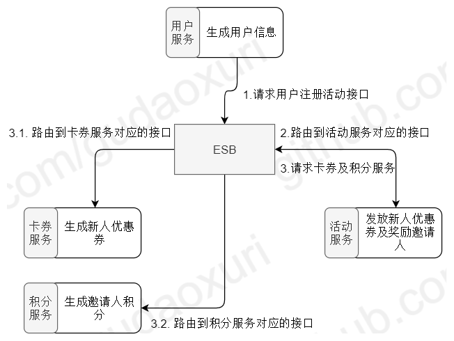
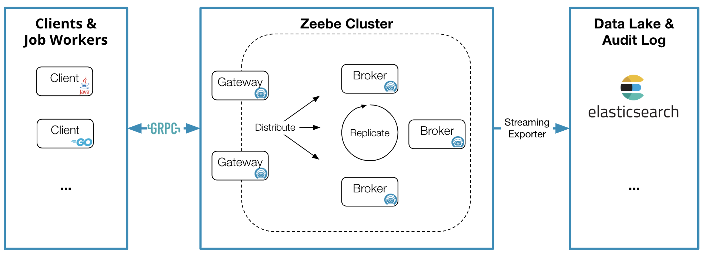

[TOC]

# 背景介绍

## 何为编排

在计算机科学和软件工程中，"编排"是指协调和管理多个独立组件或服务，以实现特定的业务流程或工作流程。它涉及到在一个整体系统中将各个组件或服务按照预定的顺序和方式进行调度、执行和交互。编排通常用于构建分布式系统、集成不同的服务或微服务，并实现复杂的业务逻辑和流程。编排的目标是通过协调和组织各个组件或服务之间的交互，以实现特定的功能和业务需求。
编排可以涉及以下几个方面：

1. 流程定义：编排定义了业务流程或工作流程的步骤、顺序和条件。它描述了系统中各个组件或服务之间的依赖关系和交互方式。
2. 调度和协调：编排负责根据流程定义，调度和协调各个组件或服务的执行。它确保在正确的时间和顺序下启动和运行每个组件，以满足整体流程的要求。
3. 数据传递和转换：编排负责管理数据在各个组件或服务之间的传递和转换。它确保正确的数据被传递给需要的组件，并处理数据格式转换和映射等。
4. 错误处理和故障恢复：编排需要处理可能发生的错误和故障情况。它可以包括错误处理、重试机制、故障恢复策略等，以确保整个流程的可靠性和稳定性。
编排可以使用不同的工具和技术来实现，例如工作流引擎、编排引擎、容器编排平台等。这些工具提供了一种便捷的方式来定义、执行和管理复杂的业务流程或工作流程。
总之，编排是一种在分布式系统或微服务架构中协调和管理多个组件或服务的方式，以实现特定的业务逻辑和流程。它涉及到定义流程、调度执行、数据传递、错误处理等任务，以实现系统的整体功能和要求。

## 编制(Orchestration)VS编排(Choreography)

对于编排的概念定义，业界其实有过激烈的讨论，其中讨论得一个很有意思的点是编制(Orchestration)和编排(Choreography)的区别，本文汇总了一些关于这方面的讨论和大家进行分享，感兴趣的可以参考 [编配和编排的定义之争](https://www.infoq.cn/news/2008/09/Orchestration/)。
编制的英文是 Orchestration，本意是乐队指挥，在演出的时候，乐队由指挥来统一的进行指挥和控制。编排的英文是 Choreography，本意是舞蹈编舞，舞蹈表演通常是舞蹈演员对外部感应作出响应，比如音乐的响应，并且需要与舞伴的行动和表情进行配合。
单从字面看 Orchestration为管弦乐曲，由一人负责指挥与调控各个乐师，而Choreography为舞蹈，各个舞蹈者多为对等关系，没有统一的协调者。事实上也是如此，Orchestration需要类似ESB的服务总线来统一管理调度各个服务间的通讯，而Choreography更强调的是各服务自治，各自自己去调用需要的服务，相对而言更去中心化。


编制（Orchestration）强调的是通过一个可执行的中心流程来协同内部及外部的服务交互。通过中心流程来控制总体的目标，涉及的操作，服务调用顺序，其就像好像交通信号灯，控制着车辆什么时候可以通行。而编排（Choreography）强调的是协作，通过消息的交互序列来控制各个部分资源的交互。参与交互的资源都是对等的，没有集中的控制，其就好像是环岛，没有集中的控制，只有一系列的规则来指明车辆在接近十字路口的时候必须要等待，直到有空间进入环岛环绕系统，然后寻找适当的时候离开。


编制（Orchestration）是有中心化调度服务以协调各组件通信的方式，以用户注册流程为例：


各服务间都通过ESB进行数据通信，用户注册后会向ESB发送调用活动服务的用户注册接口，ESB会将对应的请求路由给活动服务，活动服务收到请求并处理后又向ESB发送调用卡券服务生成卡券，调用积分服务生成积分，ESB路由此请求给卡券服务和积分服务。我们可以在ESB中做集中式的权限管控、日志处理等增强操作，这是它很大的优势，但也带来了不少的问题，存在中心化的ESB，所有请求都要经由ESB，所以在性能、扩展性、灵活性上会比较差。

编排（Choreography）则是去中心化的、点对点的通信的方式，还是以注册为例：

所有的请求都是直接调用对应的服务，没有ESB，这带来的直接好处是性能的提升，但是存在一定的服务耦合，比如用户服务就需要感知到卡券服务及活动服务，活动服务需要感知到卡券服务，但是这点其实**可以通过事件驱动架构来优化**。

当然，**刻意的区分 “编制” 与 “编排” 并没有多大价值**，**重要的是保证各参与方对所用的术语有共同的理解**，业内也并未普遍区分“编制” 与 “编排”的区别，并以编排来泛指了“编制” 与 “编排”这两种流程设计模式，故本文中后续内容的编排采用业内普遍看法，代指为“编制” 与 “编排”。

## 长流程VS短流程

流程有长流程和短流程之分:

- 长流程是指包含人工活动的流程，流程的完成时间因为人的因素会在一个较大范围内波动；
- 短流程指的是不包含人工活动的流程，在流程启动后会在一个较短的预期时间内完成。
  
**本文介绍的流程编排主要是短流程相关的编排**。

## 编排的类型

### 流程编排（Process Orchestration）

流程编排是指在一个系统或平台中，通过编排多个组件（如任务、操作、触发器等）来实现特定的业务流程。这些组件之间可以通过逻辑连接方式相互关联，以达到流程自动化和任务自动执行的目的。
流程编排一般用于自动化任务和流程，可以有效提高工作效率和业务执行的准确性。常见的应用场景包括数据处理、自动化测试、CI/CD（持续集成 / 持续交付）、工作流等。

### 服务编排（Service Orchestration）

服务编排是指在服务级别对多个独立的服务进行协调和管理，以实现特定的业务流程或工作流程。它涉及到定义和管理服务之间的依赖关系、交互方式和执行顺序，以满足业务需求。服务编排通常用于构建分布式系统或微服务架构，将各个服务按照业务流程组织起来，并通过编排引擎或工作流引擎来实现服务之间的交互和协调。

### 容器编排（Container Orchestration）

容器编排是指在容器级别对多个容器进行协调和管理，以实现高效的部署、伸缩和运维。它涉及到管理容器的创建、启动、停止、伸缩、网络配置等，以实现容器化应用程序的管理和调度。容器编排工具（如 Kubernetes）提供了自动化容器管理的能力，使得在分布式环境中大规模运行和管理容器化应用程序变得更加简单和可靠。

### 应用编排（Application Orchestration）

应用编排是指在应用程序级别对多个组件、服务或模块进行协调和管理，以实现特定的应用程序功能或业务流程。它涉及到在应用程序中定义和管理组件之间的依赖关系、交互方式和执行顺序。应用编排通常用于构建复杂的企业应用程序，协调不同的服务、模块和组件来实现整体功能。

应用编排、服务编排和容器编排是针对不同层级的编排实践。应用编排和服务编排关注在应用程序或服务级别的组件协调和管理，而容器编排关注在容器级别的部署、伸缩和运维。这些编排实践都旨在提高系统的可靠性、可伸缩性和效率，并简化复杂系统的管理和运维工作。而流程编排的概念则是可大可小，从大的方面来说，活动即流程，应用、服务以及容器都属于流程的一部分，则可以认为流程编排包含了应用编排、服务编排和容器编排；从小的方面来说，则可以认为服务里的函数执行也算是流程编排，粒度比服务编排更低。

## 工作流引擎VS流程引擎VS规则引擎VS决策引擎

- 流程引擎就是 “业务过程的部分或整体在计算机应用环境下的自动化”，它主要解决的是 “使在多个参与者之间按照某种预定义的规则传递文档、信息或任务的过程自动进行，从而实现某个预期的业务目标，或者促使此目标的实现”。通俗的说，流程就是多种业务对象在一起合作完成某件事情的步骤，把步骤变成计算机能理解的形式就是流程引擎。
- 工作流引擎和流程引擎是同一个意思，其是对工作流程及其各操作步骤之间业务规则的抽象、概括描述。在计算机中，工作流属于计算机支持的协同工作（CSCW）的一部分。工作流概念起源于生产组织和办公自动化领域，是针对日常工作中具有固定程序活动而提出的一个概念，目的是通过将工作分解成定义良好的任务或角色，按照一定的规则和过程来执行这些任务并对其进行监控，达到提高工作效率、更好的控制过程、增强对客户的服务、有效管理业务流程等目的。即工作流主要解决的问题是为了实现某个业务目标，利用计算机在多个参与者之间按某种预定规则自动传递文档、信息或者任务。工作流引擎是一个预先编码的脚本，它考虑了工作流设计，即任务应该如何从一个阶段流向另一个阶段，并执行该步骤。工作流引擎是嵌入在软件中的代码，用于将任务从一个阶段推送到另一个阶段。
- 规则引擎
业务规则引擎可以理解为程序中的一组条件，如果满足所有条件，则执行相应的程序代码。它是关于设置一个软件在特定参数内的行为准则。规则引擎的优点是，它允许非技术性软件用户根据其业务需求更改软件行为，而无需更改底层代码。业务规则引擎根据大量的信息数据做出快速可靠的决策，通常这些数据对于人类大脑来说太大了，无法处理。业务规则引擎是一个更广泛的概念中的一部分，它的范围甚至超出了工作流管理。规则引擎无法控制编排任务，但它们根据特定条件为推断决策指南。同时，它还可用于在给定条件下模拟工作流的过程。

工作流引擎和业务规则引擎都允许非技术性的最终用户在运行时更改流程行为，而无需更改代码。但它们的不同之处多于相似之处。如上所述，它们的工作模式和目的有着根本的不同。下面列出了工作流引擎和业务规则引擎之间的一些其他区别：


- 决策引擎
决策，指决定的策略或办法。是人们为各种事件出主意、做决定的过程。它是一个复杂的思维操作过程，是信息搜集、加工，最后作出判断、得出结论的过程。而决策引擎是指企业针对其客户提供个性化服务的决策平台，这些个性化服务决策包括：风险决策、精确营销决策等。
决策引擎就是把商业规则转换成商业决策，在决策引擎之上可以开发出各种不同的解决方案。

规则引擎是一个工具，本身是不带规则的，规则需要人为输入，可单独将规则从系统剥离出来放到规则引擎平台单独进行执行管理。具有一定智能化的使用价值，可以按照需求来进行规则的配置、执行、管理，不同的行业都可以配置出属于自己不同的规则平台。
而决策引擎，就是已经包含了很多的规则、决策条件，具备了对规则的决策能力，如风控决策引擎，就是在金融行业的风险控制环节进行决策的。

# 流程编排从0到1

# 开源编排框架调研

## Zeebe

### 基本介绍

[Zeebe](https://docs.camunda.io/docs/0.26/components/zeebe/deployment-guide/getting-started/)是一个用于微服务编排的开源工作流引擎。在Camunda基于BPMN2.0工作流基础上衍生出来的，设计很灵活，不需要依赖后端的存储，支持复制、分片（借鉴了kafka），支持同步和异步发起流程，它提供了：

- 可见性 (visibility)：Zeebe 提供能力展示出企业工作流运行状态，包括当前运行中的工作流数量、平均耗时、工作流当前的故障和错误等；
- 工作流编排 (workflow orchestration)：基于工作流的当前状态，Zeebe 以事件的形式发布指令 (command)，这些指令可以被一个或多个微服务消费，确保工作流任务可以按预先的定义流转；
- 监控超时 (monitoring for timeouts) 或其他流程错误：同时提供能力配置错误处理方式，比如有状态的重试或者升级给运维团队手动处理，确保工作流总是能按计划完成。

为了应对超大规模，Zeebe 支持：

- 横向扩容 (horizontal scalability)：Zeebe 支持横向扩容并且不依赖外部的数据库，相反的，Zeebe 直接把数据写到所部署节点的文件系统里，然后在集群内分布式的计算处理，实现高吞吐；
- 容错 (fault tolerance)：通过简单配置化的副本机制，确保 Zeebe 能从软硬件故障中快速恢复，并且不会有数据丢失；
- 消息驱动架构 (message-driven architecture)：所有工作流相关事件被写到只追加写的日志 (append-only log) 里；
- 发布 - 订阅交互模式 (publish-subscribe interaction model)：可以保证连接到 Zeebe 的微服务根据实际的处理能力，自主的消费事件执行任务，同时提供平滑流量和背压的机制；
- BPMN2.0 标准 (Visual workflows modeled in ISO-standard BPMN 2.0)：保证开发和业务能够使用相同的语言协作设计工作流；
- 语言无关的客户端模型 (language-agnostic client model)：可以使用任何编程语言构建 Zeebe 客户端。

Zeebe架构主要包含 4 大组件：client, gateway, brokers 以及 exporters:


- Client
嵌入到应用程序 (执行业务逻辑的微服务) 的库,可以完全独立于 Zeebe 扩缩容，用于跟 Zeebe 集群连接通信。客户端通过基于 HTTP/2 协议的 gRPC 与 Zeebe gateway 连接, 可用于：
  - 部署流程
  - 处理业务逻辑
  - 可以集成到各种语言项目中进行使用
  Client 中，执行单独任务的单元叫 JobWorker。
JobWorker定期请求某种类型的工作（即轮询）。此间隔和请求的作业数量可在 Zeebe 客户端中配置。如果请求类型的一项或多项作业可用，则 Zeebe会将激活的作业流式传输给工作人员。接收到作业后，JobWorker执行它们，并根据作业是否可以成功完成，为每个作业发回完成或失败命令。
许多JobWorker可以请求相同的工作类型，以扩大加工规模。在这种情况下，Zeebe 确保每个作业仅发送给其中一个JobWorker。此类作业被视为已激活，直到作业完成、失败或作业激活超时。


- Gateway：
  - zeebe集群的统一入口点，将请求转发给代理
  - 网关是无状态的，可以根据需要添加网关，以实现负载平衡和高可用性
- Broker：
Broker 是分布式的流程引擎，维护运行中流程实例的状态。Brokers 可以分区以实现横向扩容、副本以实现容错。通常情况下，Zeebe 集群都不止一个节点。broker 不包含任何业务逻辑，它只负责：
  - 处理客户端发送的指令
  - 存储和管理运行中流程实例的状态
  - 分配任务给 job workers
Brokes 形成一个对等网络 (peer-to-peer)，这样集群不会有单点故障。集群中所有节点都承担相同的职责，所以一个节点不可用后，节点的任务会被透明的重新分配到网络中其他节点。

- Exporter: 提供 Zeebe 内状态变化的事件流。这些事件流数据有很多潜在用处，包括但不限于：
  - 监控当前流程的执行状态
  - 分析历史工作流数据，用于审计、商业使用
  - Zeebe异常追踪

- 额外的扩展组件：
  - Modeler：一个创建和编辑BPMN可视化工具。可以远程运行、部署BPMN文件
  - Operate：一个监控Zeebe流程执行的可视化工具
  - Tasklist：是一个在Zeebe中处理用户任务的工具。您可以过滤、声明和完成用户任务。

### 代码示例

```Java

// 1、创建和gateway交互的client
final String gatewayAddress = System.getenv("ZEEBE_ADDRESS");
final ZeebeClient client =
            ZeebeClient.newClientBuilder()
                .gatewayAddress(gatewayAddress)
                .build();

// 2、使用client部署工作流程
final DeploymentEvent deployment = client.newDeployCommand()
            .addResourceFromClasspath("order-process.bpmn")
            .send()
            .join();    

// 3、创建工作流实例
final Map<String, Object> data = new HashMap<>();
        data.put("orderId", 31243);
        data.put("orderItems", Arrays.asList(435, 182, 376));
final WorkflowInstanceEvent wfInstance = client.newCreateInstanceCommand()
    .bpmnProcessId("order-process")
    .latestVersion()
    .variables(data) // data 为流程实例上下文参数
    .send()
    .join();

// 4、创建JobWorker接收类型为“payment-service”的执行任务
// “payment-service” 为“order-proces”流程中的任务节点
final JobWorker jobWorker = client.newWorker().jobType("payment-service")
    .handler((jobClient, job) ->
    {
        final Map<String, Object> variables = job.getVariablesAsMap();

        System.out.println("Process order: " + variables.get("orderId"));
        double price = 46.50;
        System.out.println("Collect money: $" + price);

        final Map<String, Object> result = new HashMap<>();
        result.put("totalPrice", price);

        jobClient.newCompleteCommand(job.getKey())
            .variables(result)
            .send()
            .join();
    })
    .fetchVariables("orderId")
    .open();
```

### 总结
 
由上可知，Zeebe 是有中心控制的

## Conductor

## kstry

## LiteFlow

## turbo

## Compileflow

### 开源对比


# 流程编排在保险业务的应用


# 参考文献

- [服务都微了，编排怎么整？](https://cloud.tencent.com/developer/article/1080878)
- [一文读懂微服务编排利器 —Zeebe](https://www.infoq.cn/article/lh7wh4x2i1zcx8mikoho)
- [Orchestration vs Choreography](https://camunda.com/blog/2023/02/orchestration-vs-choreography/)
- [编制与协同设计](https://gudaoxuri.gitbook.io/microservices-architecture/wei-fu-wu-hua-zhi-ji-shu-jia-gou/services-invoke)
- [编排的概念以及应用编排，服务编排和容器编排的区别](https://developer.aliyun.com/article/1270564)